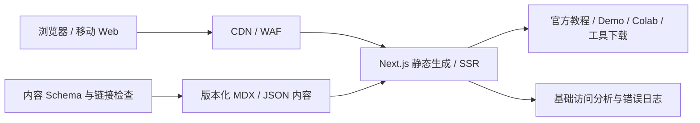
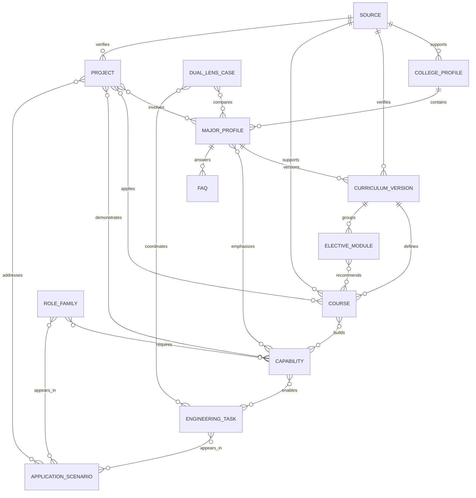

# HseeHub 健康工程双专业与跨行业能力探索站：产品与搭建参考

> 状态：Draft v0.4  
> 基线日期：2026-08-13  
> 项目性质：绿地项目（当前无代码、无历史数据、无既有技术约束）  
> 参考对象：[SZTUBitByte](https://sztubitbyte.com/)  
> 专业依据：《智能医学工程2025级本科人才培养方案》《生物医学工程2025级本科人才培养方案》与健康与环境工程学院公开介绍；2024 级方案仅作历史版本参考  
> 首版目标：让学生在 5 分钟内理解同院两个专业的共同底座与不同侧重，在 10 分钟内发现至少 3 类跨行业场景，并找到一个可以继续尝试的小项目  
> 适用范围：首版内容与页面设计、后续扩展边界、搭建顺序和验收方法

## 0. 怎么用这份参考

本文保留了完整的调研与技术依据，但真正影响首版的内容只有三件事：专业怎么讲清楚、页面怎么串起来、学生下一步能做什么。其余架构章节是后续扩展参考，不是首版待办清单。

文中把内容分为三类，避免把参考项目的现状误当成 HseeHub 的既定需求：

- **观察事实**：在 2026-08-13 对参考站公开、未登录页面的实际观察。
- **设计推断**：根据页面结构、交互和公开技术线索推断出的设计意图；并非参考站官方说明。
- **HseeHub 决策**：面向绿地项目的推荐基线，是本规范真正需要实施和验收的部分。

为了便于执行，文中偶尔使用以下强度词：

- **MUST / 首版要做**：第一版没有它就无法完成“认识专业”的目标。
- **SHOULD / 建议做**：能明显改善理解，但可以根据内容准备情况调整。
- **MAY / 以后再做**：只有真实需求出现后才加入，不作为首版前置条件。

本规范不要求复制参考站的品牌、文案、数据、图标或页面像素；参考的是它的任务组织方式与设计逻辑。

---

## 1. 执行摘要

HseeHub 首先是一个“帮助学生看懂健康与环境工程学院两个工程专业及其跨行业能力”的探索站，而不是学院宣传页、专业优劣排行榜或医疗行业招聘站，也不是一开始就做成复杂的学习平台。首页先回答“两个专业共同解决什么问题、各自更强调哪些工程任务、这些能力还能用在哪里”，再展开课程、项目、问题场景和跨行业去向。

整站采用四个相互独立但可交叉浏览的轴：

```text
专业透镜轴：同一个问题，两个专业分别更关注什么
能力轴：课程让我逐渐会什么
问题场景轴：这些能力可以解决哪些真实问题
成长证据轴：我能用什么项目或作品证明自己做过
```

“医疗健康”是两个专业共同的重要起点和应用场景，但不是导航、项目或职业内容的唯一分类。智能医学工程与生物医学工程存在大量交叉，HseeHub 只呈现培养方案反映的侧重，不把它们写成互斥赛道，也不替学生作专业选择。

首版采用以下基线：

1. **产品形态**：首版是公开的学院双专业与能力探索门户；登录后的成长工作台属于后续扩展。
2. **信息架构**：以用户任务组织，而不是按组织部门组织。
3. **工程形态**：首版以静态/服务端生成内容为主，课程、能力、场景和项目先用版本化内容文件维护，不强制建设数据库与后台服务。
4. **前端基线**：Next.js App Router + React；公共内容直接输出可索引 HTML，关系图、筛选等交互按需客户端化。
5. **UI 基线**：可访问交互原语 + HseeHub 语义化 Design Token + CSS Modules；管理后台可使用 Ant Design，禁止在业务组件中散落硬编码颜色。
6. **内容基线**：默认展示两个 2025 级培养方案；课程、学分、选修模块、学院介绍和外部项目均记录专业、适用年级、来源版本和最后核验时间。2024 级内容仅在“历史版本”中按需查看，不进入首页主叙事。
7. **身份与治理**：首版公开浏览不要求登录；只有在加入收藏、进度、投稿或社区后才建设账户和权限。
8. **交付策略**：先完成“认识学院与双专业、比较课程侧重、看懂可迁移能力、试一个同题双解项目”，再考虑学习进度、项目协作和社区；在线模型运行最后接入并单独隔离。

### 1.1 不做什么

MVP 不应把两份培养方案原文、招生宣传、完整 Wiki、论坛、登录系统、在线实验和招聘系统一次性堆在一起。首版只做学院与双专业认识、共同底座/差异对照、能力与课程地图、跨行业场景、代表项目和 FAQ；没有真实内容的模块直接隐藏，不展示“空壳导航”。它也不承诺专业优劣、精确岗位匹配、薪资预测或“读这个专业只能做什么”。

### 1.2 首版页面一眼图

```text
顶部：HseeHub｜学院与专业｜能力与课程｜项目探索｜发展场景

① 一句话
   同在健康与环境工程学院，两个专业从不同工程侧面服务生命健康问题。
   智能医学工程：更突出 AI、数据、信息系统、智能仪器与机器人。
   生物医学工程：更突出电子、材料、医学检测、器械设计与测试。
   还能用在：医疗健康、AI/软件、电子物联、机器人、汽车与智能制造等场景
   [5 分钟看懂两个专业]

② 共同底座与不同侧重
   共同：数理自然科学｜生命健康｜编程电子｜信号系统｜实验研究｜工程责任
   对照：2025 级课程结构｜选修能力模块｜实践环节｜总学分（不作难度排名）

③ 同题双解
   同一个可穿戴/影像/康复问题：算法与信息视角 ↔ 器械、材料与检测视角
   再看两种视角如何在一个项目团队中协作

④ 八类可迁移能力
   生命健康理解｜数理与研究｜感知与检测｜信号图像与 AI｜软件信息系统｜电子嵌入式与控制｜材料器械与制造｜设计验证与责任

⑤ 能力迁移示例
   图像算法：医学影像 ↔ 工业视觉 ↔ 自动驾驶
   传感系统：生命体征 ↔ 可穿戴 ↔ 环境监测 ↔ 设备运维
   材料与检测：生物材料 ↔ 传感材料 ↔ 质量检测 ↔ 高可靠产品

⑥ 今天先试一个
   单专业快速体验｜双专业协作挑战｜跨行业迁移项目

⑦ 学生常问
   两个专业哪里相同？区别只是“软件/硬件”吗？要学医吗？只能进医疗行业吗？

页尾：默认 2025 级｜历史版本入口｜学院官方入口｜项目来源与最后核验时间
```

页面文字遵循“先说人话，再给正式来源”：标题和摘要回答学生问题，课程名、学分、法规名词和数据许可放在可展开详情中。每一屏只保留一个主操作，次级入口使用普通文字链接。

### 1.3 本次重构的边界变化

| 原先容易形成的理解 | 重构后的主线 |
|---|---|
| 只从智能医学工程介绍学院 | 同时呈现智能医学工程与生物医学工程，并解释共同底座、不同侧重和协作关系 |
| 按若干医疗专业方向介绍“以后做什么” | 以“八类能力 × 工程任务 × 应用场景”解释能力如何形成和迁移 |
| 课程表是专业介绍的主体 | 课程只是起点，继续连接能力、任务、项目证据与目标场景的新门槛 |
| 两个专业分别展示、互不相干 | 用“同题双解”和跨专业角色卡呈现算法/信息、器械/材料/检测如何共同完成项目 |
| 项目主要服务医疗案例 | 首发覆盖数据/AI、传感/仪器、材料/检测或机器人/控制，并展示同一方法在不同场景的变化 |
| 发展页等于企业或岗位列表 | 发展路径同时覆盖就业、深造、科研、竞赛和创业；岗位使用稳定的岗位族表达 |
| “学过某项技术”即“适合某个行业” | 每个迁移案例同时说明可复用部分、领域知识、工具链、安全责任和待补能力 |

因此，HseeHub 不是把医疗内容替换成更多行业标签，也不是制作两份培养方案摘要，而是建立一套能解释“两个专业如何分工协作、为什么可以迁移、迁移时还缺什么、如何用作品验证”的学习导航。

---

## 2. 参考站研究结论

### 2.1 已观察到的全局信息架构

参考站公开顶部导航包含：

| 导航 | 路由 | 用户意图 |
|---|---|---|
| 首页 | `/` | 获取当前最值得关注的信息和快捷操作 |
| 学习路线 | `/paths` | 按路径组织学习过程 |
| 实验室 Lab | `/lab` | 进入 CTF、Code 等实践任务 |
| 探索空间 | `/explore` | 发现活动和外部机会 |
| 实习就业 | `/career` | 获取职业相关内容 |
| 社区广场 | `/community` | 讨论、交流和经验分享 |
| 知识 Wiki | `/wiki` | 阅读与贡献结构化知识 |
| 登录/创建账号 | `/login`、`/register` | 建立身份和保存个人状态 |

首页在 1280 × 720 桌面视口下采用“主内容 + 个人侧栏”的工作台结构：

- 顶部为 68px sticky header。
- 页面左右留白约 24px，主内容区与右侧栏并列。
- 主列首先呈现实验室、写 Wiki、社区消息三个快捷入口。
- 之后依次出现本周推荐、平台公告、最新动态、近期活动。
- 右侧栏承载个人足迹、活跃热力图、日历和全站数据。
- 未登录状态仍显示个人数据骨架/零值，表明首页模板同时服务访客与成员。

### 2.2 核心设计逻辑

#### 任务先于宣传

参考站没有用大幅 Hero 区域解释“我们是谁”，而是直接回答“现在能做什么”。这降低了回访用户的操作成本，符合高频社区工具而非一次性营销站的定位。

#### 多内容域通过统一动态流连接

Wiki、社区、活动和 Lab 并非彼此孤立。首页把不同类型内容压缩为统一的“标题 + 类型 + 时间 + 参与度”摘要，使用户在一个视图中获得跨域态势。

#### 公共信息与个人上下文并置

主列呈现全站内容，侧栏呈现个人足迹。两者并置让用户同时看见“社区正在发生什么”和“我进行到了哪里”。

#### 高信息密度由一致的视觉语法控制

参考站以小标题、紧凑列表、低对比边框、轻阴影、类型色标和一致元数据行控制密度。卡片并不依赖大图片，因此更适合知识与工具型社区。

#### 主题系统建立在语义变量上

公开计算样式显示其颜色使用语义 CSS 变量，例如 `--ink`、`--muted`、`--surface`、`--line`、`--accent`，亮暗主题对同一语义变量换值，而不是在组件内逐处覆盖。

### 2.3 公开视觉与技术证据

以下数据用于理解方法，不是 HseeHub 必须复制的品牌值：

| 项目 | 观察值/线索 | 解释 |
|---|---|---|
| 正文字体 | `Inter, Noto Sans SC, Microsoft YaHei, system-ui, sans-serif` | 中英混排与跨平台可读性优先 |
| 主文字（亮色） | `#14171c` | 接近黑色而非纯黑，减轻高密度页面压迫感 |
| 强调色（亮色） | `#2458d3` | 用于链接、焦点、图表和关键状态 |
| 页面表面（亮色） | `#ffffff` / `#f6f8fa` | 白色主表面 + 微灰次表面 |
| 分隔线（亮色） | `#dfe3e8` | 低对比结构线 |
| 页面表面（暗色） | `#141820` / `#1c222d` | 非纯黑暗色层级 |
| 强调色（暗色） | `#6b93f0` | 暗色环境提高明度 |
| 卡片阴影 | `0 1px 2px ... , 0 12px 30px ...` | 一层定义边界，一层制造轻微浮起 |
| 基础圆角 | 公开按钮示例为 6px | 克制、偏工具型而非夸张圆润 |
| 内容宽度变量 | `--workspace-content-max: 1480px` | 面向宽屏工作台 |
| 阅读宽度变量 | `--reading-measure: 820px` | 长文与工作台使用不同宽度约束 |
| UI 组件线索 | DOM 出现 `ant-*` 类名 | 高置信使用 Ant Design 组件体系 |
| 前端线索 | `#root`、`jsx-runtime`、ES module hashed assets | 高置信 React 类 SPA；构建器仅可作推断 |
| 图表线索 | DOM 中出现 Recharts 生成标识 | 高置信使用 Recharts 类组件绘制统计图 |
| 图标线索 | SVG 出现 `lucide-*` 类名 | 高置信使用 Lucide 图标 |
| API 线索 | 同源 `/api/{domain}/{resource}` 请求 | REST 风格；未观察到 GraphQL |
| 部署线索 | Cloudflare 验证页与 RUM beacon | 可确认使用相关接入能力，不能据此断言完整托管拓扑 |

公开页面还采用 `zh-CN` 语言声明、语义化 banner/main/navigation/complementary 区域和具名主题切换按钮，这些做法应保留。

参考站还表现出路由级代码分割：公开路由分别加载 `HomePage-*`、`LabDashboardPage-*`、`CommunityPages-*`、`WikiPages-*` 等哈希 chunk。首页则从 Wiki、Community、Explore、Lab 等多个同源 API 聚合数据。前者值得借鉴；后者在模块增多时会造成请求扇出。HseeHub 首版不需要动态聚合；Phase 2 真正出现动态模块后再使用聚合读模型。

需要避免照搬的细节：参考站模块间存在字号、圆角和断点碎片化；390px 级移动视口的顶栏容易同时挤入折叠菜单、身份和主题操作。HseeHub 必须使用统一 token/组件状态和明确移动导航，而不是逐页面补媒体查询。

### 2.4 借鉴、改造与舍弃

| 分类 | 项目 | HseeHub 处理方式 |
|---|---|---|
| 借鉴 | 任务优先首页 | 保留；第一屏必须提供 3–5 个高频入口 |
| 借鉴 | 主内容 + 个人侧栏 | 保留；仅在有足够宽度和有效个人数据时出现 |
| 后期借鉴 | 跨域最新动态 | 首版舍弃；Phase 2 有真实动态内容后再由统一 Activity/Event 模型驱动 |
| 借鉴 | 语义化亮暗主题 | 保留；颜色全部经由 token 消费 |
| 借鉴 | 长文阅读宽度独立 | 保留；工作台和文章页不能共用同一 max-width |
| 改造 | 7 个同级一级导航 | 首版收敛为 4 个；其余按真实需求和内容准备情况开放 |
| 改造 | 未登录也显示全零个人足迹 | 改为价值说明 + 登录 CTA，避免无意义的零值噪声 |
| 改造 | 首页同时发起多域数据请求 | 首版完全不用；Phase 2 再使用聚合读模型和分区容错 |
| 改造 | 活动、职业、探索边界可能重叠 | 在 HseeHub 中定义清晰分类和唯一主归属 |
| 舍弃 | 品牌素材、原文案、原始数据 | 不复制；仅复用抽象设计模式 |
| 舍弃 | MVP 阶段的全站复杂图表 | 数据不足时用可信摘要，不制造“仪表盘感” |

### 2.5 热门项目对标：借机制，不拼功能数量

除 SZTUBitByte 外，本方案还抽样研究了学习路线、开放医学资源、可运行示例和作品社区。选择标准不是单看 GitHub Star，而是项目仍可访问、核心机制清楚，并且能回答 HseeHub 的某个学生问题。作为热门规模旁证，核验时 roadmap.sh 官方页约 36 万 GitHub Stars、280 万注册用户，OSSU 约 20 万 Stars，freeCodeCamp 约 45 万 Stars，The Odin Project 官方页约 188 万 learners；roadmap.sh 官方更新列表到 2026-07、OSSU 仓库提交活动到 2026-07，说明其中至少部分样本仍在维护。这些都是 2026-08-13 的动态快照，只用于解释选样，不作为 HseeHub 的成功指标。

| 参考项目 | 它解决的问题 | 值得吸收的机制 | HseeHub 不照搬的部分 |
|---|---|---|---|
| [roadmap.sh](https://roadmap.sh/) | 初学者不知道先学什么 | 可视化路径、节点先后关系、角色/主题入口、社区维护 | 不把一张路线扩成上百个节点；首版只画四阶段和关键课程关系 |
| [OSSU Computer Science](https://github.com/ossu/computer-science) | 免费资源很多，但缺少完整学习顺序 | Intro/Core/Advanced/Final Project 分层；每项标注时长、投入和先修；课程选择有公开标准 | 不声称替代正式学位，也不把所有外部课程搬进站内 |
| [freeCodeCamp](https://www.freecodecamp.org/learn/) / [The Odin Project](https://www.theodinproject.com/paths) | 看完知识仍不会做 | 以项目验证学习，每一步都有明确成果；学习内容与社区求助相连 | 首版不自建判题、认证或庞大课程体系 |
| [Kaggle Learn](https://www.kaggle.com/learn) | 数据学习和实际 Notebook 脱节 | 短教程与练习成对、标注先修、完成后自然连接数据集和更大项目 | 不做排行榜、证书或竞赛基础设施；医疗任务不能被单一分数代表 |
| [PhysioNet](https://physionet.org/about/) | 医学数据需要可发现，也需要严格访问边界 | 数据资源卡、挑战、版本、引用与 Open/Restricted/Credentialed 访问分级 | 不镜像临床数据；只链接公开授权或合成数据，受控数据仍回到原平台申请 |
| [MONAI Tutorials](https://github.com/Project-MONAI/tutorials) | 医学影像 AI 入门环境复杂 | 初学者示例、Colab 一键运行、按任务/模态分类、可复现实验说明 | 不在 HseeHub 首版托管 GPU 或训练任务 |
| [3D Slicer Training](https://training.slicer.org/) | 医学影像工具功能多，新手无从下手 | 教程卡明确受众、时长、模块、样例数据和步骤；从 10 分钟入门逐步进阶 | 不重做桌面工具；HseeHub 负责解释场景并跳转官方教程 |
| [OHIF](https://docs.ohif.org/) | 医学影像查看与不同任务流程难统一 | 公开 Demo、按任务组织的 Mode、可扩展组件/插件边界 | 不从零开发 DICOM Viewer；仅对公开样例提供安全外链或后期嵌入 |
| [Hugging Face Hub](https://huggingface.co/docs/hub/index) | 模型、数据、论文和 Demo 容易彼此失联 | Model/Dataset Card、Collection 和 Space；一项成果同时说明用途、限制、数据、评估和演示 | 不把“能运行的 Demo”当作医学有效性证明，不自动收录来源不明模型 |
| [GitHub Discussions](https://docs.github.com/en/discussions/collaborating-with-your-community-using-discussions/about-discussions) | 项目问答与经验容易散落 | 问答分类、已解决答案、置顶、标签和治理；作品可通过个人页置顶展示 | 首版不自建社区；先用结构化 FAQ 和学校批准的外部问卷验证需求 |
| [O*NET Content Model](https://www.onetcenter.org/content.html) | 专业、技能、任务和岗位容易被混成一层 | 分开描述知识、技能、能力、工作活动、任务和职业信息，并明确可迁移技能 | 不直接照搬美国岗位和市场数据，不把外部分类当作中国就业事实 |
| [ESCO](https://esco.ec.europa.eu/en/classification/occupation-main) | 同一技能如何连接多个职业缺少统一语言 | 用技能/知识与职业的多对多图谱，区分具体 job 与稳定 occupation 概念 | 不导入其数千职业形成信息噪声；HseeHub 首版只维护少量岗位族 |
| [SkillsFuture Skills Framework](https://www.skillsfuture.gov.sg/skills-framework/skills-frameworks-faq) | 学习内容与跨行业发展缺少共同技能语言 | 将行业、岗位角色、工作任务、技术能力、通用能力和补充学习连接起来 | 不复制国外职业晋升结论；只借鉴“能力差距与下一步学习”结构 |
| [Arduino Project Hub](https://projecthub.arduino.cc/) | 同一硬件与编程能力如何迁移到不同问题 | 按产品、类型和难度发现数千个项目；传感、控制、AI 可落到环境、能源、交通、机器人等场景 | 不直接聚合未经核验的用户项目，不以浏览量代替教学质量 |

这些项目共同指向一个更轻的首版，而不是更大的平台：

1. **一张多轴地图**：用双专业、四阶段、八类可迁移能力和多个问题场景解释全貌；关系图默认只显示关键连接，学生主动切换“按专业、按课程、按能力、按场景”视图。
2. **三档项目入口**：内容体系按 `10 分钟看懂`、`1–2 小时体验`、`1–2 周小作品` 组织；首发 3 张卡至少覆盖“10 分钟”和“1–2 小时”，验证后再补齐小作品档。
3. **统一“项目体验卡”**：每张卡都回答要解决什么、需要什么基础、用什么工具、数据从哪里来、预计多久、最后得到什么、如何反思、下一步学什么。
4. **外部运行优先**：优先跳转官方 Demo、Colab、Notebook 或桌面工具教程；HseeHub 负责中文导览、来源核验和学习关系，不承担首版计算基础设施。
5. **项目即作品入口**：完成后应能得到截图、短报告、Notebook 或 GitHub 仓库等可展示成果；是否公开由学生决定。
6. **安全信息与知识信息同级**：数据访问级别、许可、版本、适用边界和最后核验时间必须出现在卡片上，不能藏在页尾免责声明里。

#### 建议的首批体验卡

以下是候选项目池。首发从中挑选 3 张，分别体现“数据/AI、传感/仪器、材料/检测或机器人/控制”，其中至少一张采用双专业角色协作；每张项目同时标记专业透镜、通用能力和多个应用场景。

| 层级 | 示例 | 能力与跨行业场景 | 可得到的成果 |
|---|---|---|---|
| 10 分钟看懂 | 比较医学影像、工业质检图和道路图像的共同处理步骤 | 信号图像；医疗、制造、汽车 | 一张“相同能力/不同约束”对照表 |
| 10 分钟看懂 | 比较心率、温湿度和设备振动三种时序信号 | 感知测量；健康、环境、设备运维 | 一张采样—噪声—特征观察表 |
| 10 分钟看懂 | 为可穿戴监测画出“检测/器械 → 嵌入式 → 算法/信息”双专业接口 | 感知检测、电子、数据 AI、产品责任 | 角色分工、输入/输出和共同验收表 |
| 1–2 小时体验 | 用公开/合成数据制作一个分类或趋势 Notebook，并比较不同应用解释 | 数据 AI；健康、环境、商业分析 | Notebook、指标解释和局限说明 |
| 1–2 小时体验 | 用 Arduino/仿真搭建“传感—处理—告警”最小系统 | 智能硬件；可穿戴、智慧环境、工业物联 | 系统图、代码/仿真和测试记录 |
| 1–2 周小作品 | 为公开数据制作一个可访问的数据故事页 | 软件系统；健康、城市、能源、教育 | 网页、数据字典和局限说明 |
| 1–2 周小作品 | 为机器人或智能设备设计“感知—决策—执行—风险控制”方案 | 控制与产品；康复、物流、制造、服务机器人 | 系统图、部件清单、风险与测试清单 |
| 1–2 周小作品 | 用公开器件/材料数据表比较检测灵敏度、稳定性和应用约束 | 材料器械、测量与验证；健康、环境、工业检测 | 选型矩阵、假设、测试方案和适用边界 |

体验卡只用于认识能力及其应用，不给出诊断结论，不采集真实患者数据，也不把一次示例运行包装成研究成果。非医疗项目同样必须说明数据许可、安全、环境影响或工程责任等适用边界。

---

## 3. HseeHub 产品架构

### 3.1 产品定位

一句话定义：**HseeHub 帮助学生看懂健康与环境工程学院两个专业的共同底座、不同技术侧重和协作关系，再把课程连接到项目、能力与跨行业场景。**

核心价值顺序：

1. 用通俗语言认识两个专业，而不是先读完两份培养方案。
2. 解释“共同学什么、各自更强调什么、为什么需要协作”，不做专业优劣排名。
3. 从课程和毕业要求中提取可迁移的知识、技能、工程任务与责任边界。
4. 通过“同题双解”看懂同一问题的算法/信息、器械/材料/检测等不同工程视角。
5. 用小项目形成可观察的作品，再连接医疗、AI、软件、电子、材料、机器人、制造等场景。

### 3.2 同院双专业到跨行业能力（学生认识版）

#### 一句话认识两个专业

两个专业都以生命健康问题为应用起点，都需要数学、自然科学、医学/生物学、电子、计算机、实验研究和工程责任，但培养方案呈现出的技术重心不同：

- **智能医学工程**方案明确提出“人工智能 + X”和校企合作双导师培养，更突出医学数据与信息系统、智能仪器、嵌入式和医用机器人，强调把感知、算法、软件和设备集成为智能系统。
- **生物医学工程**方案面向新一代医疗器械与生物医药需求，更突出电子、材料学、医学检测、仪器设计与测试，并通过分子/体外诊断、高端植介入器械、医学软件与大数据等模块连接生物医学问题与工程实现。

这不是“软件专业”和“硬件专业”的简单二分：两者都包含编程、电子、信号、仪器、研究、伦理和项目实践，只是课程组合、选修模块和典型任务权重不同。

#### 2025 级培养方案快照

| 对照项 | 智能医学工程 2025 级 | 生物医学工程 2025 级 |
|---|---|---|
| 标准修业与学位 | 四年，工学学士 | 四年，工学学士 |
| 培养表述特色 | “人工智能 + X”、校企合作双导师、“厚基础、重实践、宽口径” | 医疗器械/生物医药需求导向，电子、材料、医学检测、计算机与信息科学交叉 |
| 总学分 | 160 | 165 |
| 通识/学科/实践/论文 | 60 / 61.5 / 26.5 / 12 学分 | 60 / 70 / 23 / 12 学分 |
| 核心必修侧重 | 信号与系统、机器学习与模式识别、微机原理与嵌入式系统 | 生物化学、信号与系统、生物医学材料基础、生物医学伦理与医疗器械管理法规 |
| 方案中的选修组织 | 智能医学信息、智能医学仪器、智能医学机器人三类选课指引 | 分子诊断与体外诊断、医学软件及大数据、高端植介入器械、硬件开发与测试四类能力模块 |
| 综合实践代表 | 企业实习、医学基础实验、医学电路设计实践、高级项目研究、C++ 程序设计实践 | 行业认知与劳动、企业实习、高级项目研究 |

学分只用于帮助学生理解课程结构，不用于推断专业难度或含金量。详细课程、学期与学分必须绑定 `2025` 版本；2024 级方案只进入历史版本页。

#### 共同底座与不同课程 DNA

| 共同底座 | 智能医学工程更突出的任务 | 生物医学工程更突出的任务 |
|---|---|---|
| 人体结构、生理/生物医学与健康问题理解 | 将医学需求转成数据、算法、信息流程和智能系统需求 | 将生物/医学需求转成检测、材料、器械和实验需求 |
| 数学、自然科学、编程、电子与信号系统 | 图像/信号处理、机器学习、大模型、数据库、医院信息系统 | 医学检测、医用电子、生物材料、仪器分析、材料评价 |
| 实验设计、数据分析、现代工具与文献研究 | 软件部署、嵌入式开发、智能设备集成和机器人控制 | 分子/体外诊断、植介入器械、仪器设计、测试与制造 |
| 设计开发、团队沟通、项目管理、伦理与可持续发展 | 数据、模型、交互和系统局限性 | 生物相容性、测量可靠性、器械法规与验证 |

#### 特色模块：同题双解

HseeHub 用同一个真实问题并排展示两种专业透镜，而不是分成两个互不往来的课程目录：

| 共同问题 | 智能医学工程透镜 | 生物医学工程透镜 | 可形成的协作成果 |
|---|---|---|---|
| 可穿戴生命体征监测 | 信号处理、异常识别、嵌入式算法、数据服务与交互 | 传感与检测、电路和仪器、材料/接触界面、标定与安全测试 | 系统框图、数据链、原型、测试计划与风险清单 |
| 医学影像辅助系统 | 图像处理、机器学习、模型评估、信息系统集成 | 成像原理、设备链路、信号质量、仪器性能与验证 | 从采集到展示的端到端流程和两类误差分析 |
| 康复或辅助机器人 | 感知决策、控制、软件/硬件集成、人机交互 | 人体结构与功能、器械结构、材料、可靠性与功能测试 | 双专业角色分工、接口合同、原型与验收指标 |

每个案例都必须说明：哪些是培养方案直接支持的共同能力，哪些只是示例推演，哪些仍需领域专家、法规、实验条件或进一步课程支持。

#### 学生逐渐形成的八类可迁移能力

| 能力族 | 学生语言 | 课程/实践来源 | 可迁移示例 |
|---|---|---|---|
| 生命健康与用户理解 | 先理解人体、生物过程、使用者和场景约束 | 解剖、生理、生物/生化、专业导论、人因与伦理 | 健康照护、运动科技、老龄服务、人因与复杂产品研究 |
| 数理建模与科学研究 | 把问题变成可验证的模型、实验和证据 | 数学、物理、化学、统计、文献研究、高级项目研究 | 科研、仿真、试验设计、质量工程和通用数据分析 |
| 感知、测量与医学检测 | 让物理或生物现象变成可信数据 | 医用电子、传感与检测、仪器分析、信号与系统、生物医学光学 | 生命体征、环境监测、可穿戴、工业检测、汽车传感 |
| 信号、图像与数据 AI | 从波形、图像和数据中提取结构与规律 | 信号处理、医学成像、图像处理、机器学习、NLP、大数据 | 医学影像、工业视觉、遥感、通用 AI、城市与能源分析 |
| 软件与信息系统 | 把数据流程做成可维护的软件服务 | 程序设计、数据结构、数据库、医院信息系统 | 健康信息系统、企业软件、数据平台、互联网应用 |
| 电子、嵌入式与智能控制 | 把电路、传感、计算和执行器组成系统 | 医用电子、微机/嵌入式、电子设计、自动控制、机器人 | 医疗设备、物联网、消费电子、机器人、汽车与自动化 |
| 生物材料、器械与制造 | 让材料、结构和工艺满足功能与可靠性 | 生物医学材料、材料评价、机械/CAD、微纳加工、组织工程与人工器官 | 医疗器械、传感材料、精密制造、材料测试、高可靠产品 |
| 设计验证与工程责任 | 让方案可测试、可解释、安全且能交付 | 法规、质量、医学/工程伦理、可持续发展、项目管理与实习 | 医疗器械合规、通用产品质量、功能安全、测试认证、技术产品管理 |

这些能力在两个专业中的权重和证据来源不同。迁移也不等于零成本转行：进入汽车、工业、金融或环境等场景时，仍需补充对应领域知识、工具链、标准和实践证据。

#### 用多轴替代单一专业路线

两个方案中的三类选课指引和四类能力模块保留为版本化事实，但不作为整站唯一目录。学生还可以分别选择“想练什么能力”和“想解决什么问题”：

| 技术/任务轴 | 问题场景轴 |
|---|---|
| 感知与测量 | 医疗健康、运动与养老 |
| 信号、图像与计算机视觉 | 工业质检、遥感、交通与智能汽车 |
| 数据分析、机器学习与 NLP | 通用 AI、互联网、企业数据、城市与能源 |
| 软件、数据库与信息系统 | 医疗信息化、企业软件、数据平台与公共服务 |
| 嵌入式、物联网与智能硬件 | 可穿戴、消费电子、环境监测、工业物联 |
| 机器人、控制与系统集成 | 康复、物流、服务机器人、汽车与智能制造 |
| 生物材料、检测、器械与制造 | 医疗器械、传感材料、精密制造、检测认证 |
| 产品、质量、安全与法规 | 医疗器械、功能安全、检测认证与技术产品 |

医学影像、生命信号、医学检测、医疗仪器、医疗数据、植介入器械和医用机器人是两个专业的“领域样例”；它们不再充当排他性的毕业去向。

#### 四年学习故事

HseeHub 不向学生复制一张难读的总课表，而是把培养方案转译为四个阶段：

1. **认识学院与双专业**：接触生命健康问题和专业导论，知道两个专业的共同底座与不同观察角度。
2. **建立通用工具箱**：学习数理自然科学、生命基础、编程、电子、信号、实验研究和工程责任。
3. **形成侧重并协作**：通过各自核心课和选修模块深入 AI/信息/智能系统，或材料/检测/器械/测试，同时参与同题双解项目。
4. **形成作品与选择**：通过高级项目研究、竞赛、校企合作、实习和毕业设计形成个人能力证据，再选择深耕场景。

两个 2025 级方案都设置高级项目研究、企业实习和 12 学分毕业论文；智能医学工程专业实践为 26.5 学分，生物医学工程为 23 学分。这说明“做项目、跨专业协作、形成作品”应成为 HseeHub 的核心体验，而不是知识文章的附属功能。

#### HseeHub 如何呈现

HseeHub 应优先回答六个问题：

1. 学院里的两个专业分别是什么？共同点和差异在哪里？
2. 2025 级四年大致学什么，选修模块如何组织？
3. 同一个健康工程问题，两个专业分别更关注什么，怎样协作？
4. 每门课程在形成什么可迁移能力？
5. 同一能力可以解决哪些不同场景的问题？
6. 我可以先做哪些单专业或跨专业项目来验证兴趣？
7. 进入不同岗位族或行业还需要补什么？

页面采用双专业卡、课程 DNA、关系图、同题双解和代表性项目，避免堆砌培养目标原文。每张能力卡注明“哪个专业、哪一版培养方案、课程/毕业要求来源、典型任务、跨行业样例和能力缺口”；每个协作案例展示角色、接口、共同产物、冲突点和验收方法。

> 边界：HseeHub 是专业认识和学习导航，不是教务系统，也不提供转专业或选课结论。课程名称、开课学期和学分必须标注专业、适用年级与来源；发生冲突时，以学校当年正式培养方案和教务通知为准。

#### 跨行业发展认识

职业与研究页面不从企业名单出发，而从能力和任务出发。`/pathways` 按下面的关系帮助学生理解迁移路径：

```text
我会什么 → 可以承担哪些任务 → 哪些岗位族需要这些能力 → 哪些行业和组织存在这些岗位 → 还需补什么
```

首批覆盖的行业/发展场景包括：

- **医疗健康**：医疗器械、数字健康、医学影像、医院信息化、康复与养老科技。
- **人工智能与数据**：通用 AI、数据平台、计算机视觉、自然语言处理和数据分析。
- **软件与互联网**：软件研发、后端/数据工程、产品技术和企业信息系统。
- **电子与智能硬件**：消费电子、可穿戴设备、传感器、半导体、嵌入式与物联网。
- **机器人与智能制造**：机器人、自动化、控制、汽车智能化和工业视觉。
- **环境、城市与能源**：环境感知、智慧城市、能源数据和公共基础设施。
- **科研、检测与公共服务**：高校院所、检测认证、标准法规、公共技术和科技服务。

发展图谱采用“能力标签 + 任务标签 + 岗位族 + 场景标签”的多对多关系，同一个岗位可以跨多个行业。例如计算机视觉工程师既可能服务医学影像，也可能服务工业质检、机器人或智能汽车；嵌入式工程师既可能开发监护设备，也可能开发消费电子和工业控制产品。研究生方向、科研助理、竞赛和创业项目也可以进入同一图谱，不把发展等同于立即求职。

企业或机构条目是可筛选目录，不做主观“榜单”和综合排名。条目应展示所属行业、组织类型、匹配岗位族、相关能力、可能需要补充的知识、官方招聘入口、来源和最后核验时间；不得暗示收录即为推荐、合作关系或就业保证。

专业内容的当前主依据为校内提供的《智能医学工程2025级本科人才培养方案》和《生物医学工程2025级本科人才培养方案》；2024 级方案仅作为历史版本。学院定位参考[健康与环境工程学院概况](https://hsee.sztu.edu.cn/xygk.htm)、[智能医学工程专业介绍](https://hsee.sztu.edu.cn/info/1107/2351.htm)与[生物医学工程专业介绍](https://hsee.sztu.edu.cn/info/1107/2352.htm)。

### 3.3 用户角色

首版产品角色只有“公开访客”和“仓库内容维护者”。下表是 Phase 2 以后出现投稿、进度和社区时的目标角色，不需要为了首版提前实现。

| 角色 | 主要目标 | 默认能力 |
|---|---|---|
| 访客 Guest | 发现和阅读 | 浏览公开内容、搜索、查看活动；不能产生持久互动 |
| 成员 Member | 学习和参与 | 收藏、进度、评论、发帖、报名、提交反馈 |
| 贡献者 Contributor | 沉淀内容 | 创建 Wiki/路线/活动草稿，提交审核，维护自己内容 |
| 导师 Mentor | 提供专业引导 | 维护能力/场景说明、发布项目机会、点评学生成果；不默认拥有版务权限 |
| 版主 Moderator | 维护社区质量 | 处理举报、锁帖、下架、审核指定模块内容 |
| 管理员 Admin | 配置与审计 | 用户与角色、分类、功能开关、系统配置、审计日志 |

专业内容维护者、项目导师和职业内容审核员等是模块权限，不另建无限扩张的全局角色。权限模型采用 **RBAC + 资源所有权 + 状态约束**。

### 3.4 目标态模块

本节描述远期边界，帮助以后扩展时不互相污染；首版实际范围以 3.5 为准。

| 模块 | 责任 | 不负责 |
|---|---|---|
| Home | 聚合快捷行动、公告、动态、推荐和个人摘要 | 不持有其他模块的业务数据 |
| College & Majors | 学院概览、双专业介绍、课程结构、版本与 FAQ | 不替代正式培养方案与教务通知，不作专业优劣或选择结论 |
| Major Compare | 共同底座、不同课程 DNA、同题双解和跨专业角色 | 不把两个专业简化成软件/硬件二分，不暗示互斥 |
| Capability Map | 课程、知识、可迁移能力和典型工程任务 | 不把上过课等同于已经胜任岗位 |
| Scenario Map | 健康与非健康问题场景、约束和所需能力 | 不声称所有行业门槛相同，不维护市场预测 |
| Learn | 学习路线、章节、先修关系、进度 | 不直接执行代码或挑战容器 |
| Wiki | 版本化知识文档、标签、引用、审核 | 不承担自由讨论主场 |
| Community | 主题帖、评论、反应、举报、版务 | 不保存正式知识版本 |
| Explore | 活动、比赛、项目等可发现条目 | 不承载完整招聘流程 |
| Pathways | 跨行业岗位族、研究/深造路径、组织目录和能力缺口 | 不把发展等同于求职，不做企业排名，不处理企业 ATS 数据 |
| Projects | 跨场景体验、课程项目、竞赛、科研和校企合作机会及成果 | 不局限医疗题材，不处理科研经费或伦理审批流程 |
| Practice | 教学数据集、Notebook、仿真和实验指引 | 不处理真实临床数据，不在 Web 进程执行不可信代码 |
| Identity | 账户、资料、角色、会话和偏好 | 不包含模块业务逻辑 |
| Search | 跨域检索、筛选、排序和权限过滤 | 不作为原始内容存储 |
| Moderation | 举报、审核队列、处置、申诉、审计 | 不直接渲染业务页面 |
| Notification | 站内通知及可选外部通道 | 不拥有事件事实 |
| Activity | 统一活动事件和个人足迹读模型 | 不替代业务模块事务表 |

这些模块共同组成一条长期成长闭环：

```text
学院与双专业 → 比较课程 DNA → 看懂能力 → 同题双解 → 选择项目 → 形成作品证据 → 发现能力缺口
```

双专业导览回答“共同学什么、各自更强调什么、如何协作”，能力地图回答“课程正在形成什么”，场景地图回答“这些能力还能用在哪里”，项目帮助学生形成证据。数据模型必须允许学院、专业、培养方案版本、选修模块、课程、能力、工程任务、项目和场景多对多关联，不能用一个“医疗方向”字段把它们串成单线。

### 3.5 MVP 范围

首版一级导航建议为：**首页、学院与专业、能力与课程、项目探索、发展场景**。双专业对照是“学院与专业”的核心页；FAQ、资料来源和“关于本站”作为页内入口或更多菜单，不提前上线社区、职位库和个人中心。

MVP MUST：

- 公共首页与全局导航。
- 两个专业概览、共同底座/差异对照、2025 级学分结构、选修模块/指引、四年学习故事和学生 FAQ；明确“不排名、不替学生选专业”。
- 八类可迁移能力，以及按专业和培养方案版本呈现的“课程 → 毕业要求/能力 → 典型任务”关系图；明确“解释性导览，不替代教务，也不代表已经掌握”。
- 至少 2 个“同一问题、两种专业透镜”的同题双解案例，每个说明角色、接口、共同产物、验证方法与责任边界。
- 至少 6 张发展场景概览，覆盖医疗健康、AI/数据、软件系统、电子物联、机器人/制造、环境/城市/公共技术等场景；每张说明共用能力与额外门槛。
- 首发 3 张项目体验卡，至少覆盖数据/AI、传感/仪器、材料/检测或机器人/控制三种视角，其中至少 1 张要求双专业角色协作；每张卡含专业透镜、能力、场景、先修、工具/材料、数据来源、预计时长、产物、验证和下一步。
- 专业、版本、选修模块、课程、能力、任务、场景和项目之间可双向跳转；学生不会停在孤立课程名、专业标签或单一行业结论上。
- 培养方案、学院介绍和外部资源均显示来源、适用年级或版本、最后核验时间。
- 手机和桌面均可完成完整浏览；无 JavaScript 时仍可读取核心文字。
- 亮色/暗色/跟随系统主题。

MVP SHOULD：提供两个培养方案的课程相似/差异筛选、“同一能力在不同场景的差异”对照、打印/分享友好页面、术语解释和关系图文字等价列表。内容超过 30 个独立详情页或目录浏览明显失败后，再加入站内全文搜索。

MVP 暂缓：注册登录、个人进度、收藏、Wiki 投稿、论坛、评论、活动聚合、职位抓取、企业排名、薪资预测、真实临床数据、在线模型训练、任意代码执行、复杂推荐和独立搜索集群。任何一项只有在学生访谈或使用数据证明有需求且有人维护时才进入下一阶段。

---

## 4. 信息架构与路由规范

### 4.1 路由树

首版只发布以下公开路由。两个专业、能力、场景和项目是可交叉浏览的并列维度：

```text
/
├─ /majors                       # 学院与双专业入口
│  ├─ /majors/compare            # 共同底座、差异与同题双解
│  ├─ /majors/[majorSlug]        # 单专业通俗介绍
│  ├─ /majors/[majorSlug]/curriculum/[cohort]
│  └─ /majors/faq                # 双专业常见问题
├─ /capabilities                 # 八类可迁移能力与课程关系
│  └─ /capabilities/[capabilitySlug]
├─ /projects
│  ├─ /projects/[projectSlug]
│  └─ /projects/[projectSlug]/resources
├─ /scenarios                    # 健康与非健康发展场景
│  └─ /scenarios/[scenarioSlug]
├─ /sources                      # 培养方案、学院与项目来源
├─ /resources                    # 内容准备好后启用；精选外部资料，不做大全
└─ /about                        # 可先作为页脚内容，不强制独立页面
```

下列路由是后续能力的命名预留，不应在首版导航中创建空页面：

```text
/learn/*                         # 学习单元与进度
/wiki/*                          # 可投稿知识库
/community/*                     # 讨论与问答
/events/*                        # 活动聚合
/pathways/*                      # 岗位族、研究/深造路径与组织目录
/projects/showcase/*             # 学生作品展示
/me/*                            # 登录后个人空间
/admin/*                         # 在线内容后台
/lab/*                           # 可选隔离运行环境
```

规则：

- 路由使用小写英文、连字符和稳定 slug；中文标题变化不应改变永久 URL。
- 可分享或可恢复的用户状态必须有 URL；路线节点、活动详情和筛选不得只存在于弹窗/内存状态。
- 每个公开详情页必须具有 canonical URL、唯一标题、描述和分享摘要。
- 专业、培养年级、能力和场景筛选进入 query string；当前默认 `cohort=2025`，历史版本不得覆盖当前版本。
- 已传播的专业、课程、能力、场景和项目 URL 改名时使用重定向；外部资源失效时保留说明和替代入口，不静默消失。
- 外部资源先进入 HseeHub 的中文体验卡，再提供“打开官方教程 / 在 Colab 运行 / 下载工具”；保存来源、版本和最后核验时间。
- 后续若加入 `/admin`、个人页和草稿页，必须 `noindex`。

### 4.2 全局导航

首版桌面端：

- sticky header 高度建议 64px。
- 左侧品牌；中间为“学院与专业、能力与课程、项目探索、发展场景”；首页由品牌 Logo 返回；右侧只保留主题切换。
- 当前路由同时使用颜色、字重和下划线/底边标识，不只依赖颜色。
- 当可用宽度不足时优先折叠低频入口，禁止把中文标签压到不可读。

首版移动端：

- 顶部仅保留品牌、主题和具名“菜单”按钮。
- 四个入口进入菜单，不设置通知、个人入口或 App 式底部导航。
- 页面标题、筛选和主要操作必须保持可达，不能仅依赖 hover。

### 4.3 首页编排

首版首页是单列 `GuideLanding`，内容随 HTML 直接生成，不使用工作台侧栏，也不实时拼装多套接口。

推荐顺序：

1. “同在一个学院，两个专业怎样共同解决健康工程问题”的一句话解释，以及“5 分钟看懂两个专业”主行动。
2. 两张专业卡与 2025 级快照：共同底座、课程 DNA、选修模块、实践和学分结构；明确不作排名。
3. 两个同题双解案例：可穿戴/影像/机器人中的角色、接口、共同产物和验证方法。
4. 八类可迁移能力；每类展示两个专业的课程证据、一个健康样例和一个跨行业样例。
5. 四年学习故事和“专业版本 → 课程 → 毕业要求/能力 → 任务”地图入口。
6. “今天先试一个”：数据/AI、传感/仪器、材料/检测或机器人/控制 3 张体验卡。
7. 六类发展场景与能力缺口摘要，再进入学生 FAQ、当前来源和历史版本入口。

Phase 2 加入个性化内容和动态聚合后，再使用以下区块协议：

```ts
type HomeSection<T> = {
  id: string
  title: string
  href?: string
  status: 'ready' | 'empty' | 'partial' | 'error'
  updatedAt: string
  items: T[]
}
```

首版外部资源检查失败时只把对应体验卡标为“待核验”，不能让整页失败。Phase 2 加入 API 和个人区块时，公共内容与用户私有内容必须分别获取、分别缓存。

### 4.4 页面模板

| 模板 | 适用页面 | 结构 |
|---|---|---|
| GuideLanding | 首版首页 | 学院双专业 → 共同底座/差异 → 同题双解 → 八类能力 → 项目 → 发展场景/来源 |
| Workspace（Phase 2） | 个人中心、管理台 | 宽内容区 + 可折叠上下文侧栏 |
| Major Guide | 单专业介绍、四年故事、选修模块、FAQ | 通俗说明 + 2025 方案快照 + 历史版本 + 能力入口 |
| Major Compare | 双专业对照 | 共同底座 + 课程 DNA + 学分结构 + 同题双解 + 不作排名声明 |
| Dual Lens Case | 同题双解详情 | 共同问题 + 两种专业透镜 + 角色/接口 + 共同产物 + 验证/风险 |
| Capability Graph | 能力与课程页 | 能力定义 + 专业/版本课程证据 + 典型任务 + 多场景示例 + 项目/岗位族入口 |
| Scenario Compare | 场景页 | 问题与约束 + 共用能力 + 领域特有知识 + 代表项目 + 能力缺口 |
| Project Capsule | 项目体验详情 | 问题 → 能力/场景标签 → 适合谁 → 工具/数据 → 步骤 → 产物 → 适用边界 → 迁移思考 |
| Index | Wiki、社区、活动、路线列表 | 标题/说明 + 搜索筛选 + 结果列表 |
| Reading | Wiki、指南、公告详情 | 目录 + 760–820px 正文 + 元信息 |
| Detail | 活动、职业、挑战 | 主事实 + 状态/行动侧栏 + 关联内容 |
| Editor | Wiki、主题、活动编辑 | 表单/编辑器 + 预览 + 保存状态 |
| Auth | 登录、注册、恢复 | 单一任务、最少干扰、清晰错误与隐私说明 |

---

## 5. 核心任务流

### 5.1 专业与能力认识闭环

```text
认识学院与两个专业 → 比较共同底座和课程 DNA → 打开一个同题双解 → 查看八类能力 → 选择课程/项目 → 记下下一步
```

该流程默认无需登录。学生既能按专业查看 2025 级课程，也能按能力比较两个专业的课程证据；对照页必须避免“一个只写代码、一个只做硬件”的误导。

### 5.2 能力迁移闭环（首版）

```text
选择一项能力 → 对比健康与非健康场景 → 识别共用方法 → 看见领域差异/额外门槛 → 查看对应项目与岗位族 → 选择下一步
```

每个迁移结论必须同时呈现“可复用部分”和“不能直接复用的部分”。例如图像分割方法可以跨场景，但医学标注、工业缺陷、道路目标的错误成本、数据分布、评价方法和法规要求并不相同。HseeHub 不得用“学过 Python/AI，所以任何行业都能直接胜任”这类过度承诺。

### 5.3 项目体验闭环（首版）

```text
从专业/能力/场景进入项目卡 → 选择单人或双专业角色 → 判断“是否适合我” → 查看来源与边界 → 完成小成果 → 按接口合并结果 → 思考如何迁移 → 回看课程和进阶项目
```

首版不在站内运行模型，也不强制学生登录。项目页必须让学生在打开外部工具前知道需要安装什么、预计花多久、数据能否使用、卡住时退回哪一步。完成证明可以是截图、Notebook、短报告或系统图，由学生自行保存；作品公开功能以后再做。

### 5.4 访客发现内容（Phase 2）

```text
首页/搜索 → 列表筛选 → 详情阅读 → 收藏/评论/记录进度 → 登录 → 返回原任务完成操作
```

登录拦截 MUST 保存原始 URL 和尚未提交的安全上下文；登录完成后回到原任务，不跳回首页。

### 5.5 学习闭环（Phase 2）

```text
选择路线 → 查看先修与目标 → 开始单元 → 阅读/实践 → 标记完成 → 查看进度 → 推荐下一步
```

学习进度必须由明确事件产生，不以“打开页面”直接视为完成。

### 5.6 内容贡献闭环（Phase 2）

```text
创建草稿 → 自动保存 → 预览 → 提交审核 → 审核反馈 → 修改/通过 → 发布 → 版本记录
```

内容状态机：

```text
draft → in_review → published → archived
          ↓             ↓
      changes_requested  superseded
```

任何从 `published` 到不可见状态的动作必须记录操作者、原因和时间。

### 5.7 社区治理闭环（Phase 2）

```text
举报 → 去重/聚合 → 版主队列 → 保留/隐藏/锁定/删除 → 通知相关用户 → 审计/申诉
```

版主不能物理删除审计记录。用户删除与管理员下架需在界面和数据层区分。

### 5.8 在线实践流程（Phase 3，可选）

```text
选择教学案例 → 阅读数据来源与使用边界 → 启动隔离环境 → 运行/提交 → 结果回传 → 保存学习记录
```

MVP 只提供阅读材料、公开/合成数据和本地运行指引。未来若加入在线运行，Web 应用只负责创建任务和读取结果；不可信代码不得在 Web、数据库或通用 Worker 进程执行，真实患者数据不得进入教学环境。

---

## 6. 体验与视觉系统

### 6.1 设计原则

1. **内容优先**：图片只在传递信息时出现，不用装饰图挤压首屏。
2. **清楚胜过密度**：新生第一次看到的页面保持呼吸感；课程细节按需展开，不模仿专业工作台的信息量。
3. **行动清楚**：每个卡片最多一个主操作；整卡可点击时不得嵌套冲突链接。
4. **状态诚实**：加载、空、错误、权限不足、已下架必须有不同表达。
5. **学生语言一致**：能力、课程、场景和项目都用“为什么学、会做什么、下一步”这套语法。
6. **主题等价**：暗色不是简单反色；层级、对比、图表和状态色都需单独验证。

### 6.2 HseeHub Token 基线

以下是语义角色和初始建议；品牌色在视觉设计阶段可调整，但变量名和消费规则应稳定。

```css
:root {
  color-scheme: light;

  --color-brand: #2563eb;
  --color-brand-hover: #1d4ed8;
  --color-accent: #0f766e;

  --color-text: #171a1f;
  --color-text-secondary: #626b78;
  --color-text-tertiary: #8a94a3;
  --color-surface: #ffffff;
  --color-surface-subtle: #f6f8fb;
  --color-surface-raised: #ffffff;
  --color-border: #dfe4ea;
  --color-border-strong: #c8d0da;

  --color-success: #167451;
  --color-warning: #a85f0b;
  --color-danger: #c42b32;
  --color-info: var(--color-brand);

  --space-1: 4px;
  --space-2: 8px;
  --space-3: 12px;
  --space-4: 16px;
  --space-6: 24px;
  --space-8: 32px;
  --space-12: 48px;
  --space-16: 64px;

  --radius-sm: 6px;
  --radius-md: 10px;
  --radius-lg: 14px;

  --shadow-card: 0 1px 2px rgb(15 23 42 / 6%),
                 0 12px 30px rgb(15 23 42 / 7%);
  --shadow-lift: 0 2px 4px rgb(15 23 42 / 8%),
                 0 18px 40px rgb(15 23 42 / 11%);

  --layout-page-max: 1440px;
  --layout-reading-max: 800px;
  --layout-rail: 320px;
  --layout-gutter: 24px;
}

[data-theme='dark'] {
  color-scheme: dark;
  --color-brand: #7aa2f7;
  --color-brand-hover: #9ab8ff;
  --color-accent: #4cc9bd;
  --color-text: #e8eaed;
  --color-text-secondary: #a1a9b6;
  --color-text-tertiary: #7f8998;
  --color-surface: #141820;
  --color-surface-subtle: #1c222d;
  --color-surface-raised: #202733;
  --color-border: #2a3140;
  --color-border-strong: #394356;
}
```

业务代码只能消费语义 token。不得出现 `color: #...`、`background: rgb(...)` 等无说明硬编码；数据可视化调色板在独立 chart token 中维护。

### 6.3 字体与排版

- UI 字体：`Inter, "Noto Sans SC", "Microsoft YaHei", system-ui, sans-serif`。
- 代码/技术标识：`SFMono-Regular, Consolas, "Liberation Mono", monospace`。
- 正文基础字号 16px；密集列表元数据可用 12–14px，但交互标签不得小于 14px。
- 正文行高 1.6–1.75；UI 行高 1.4–1.55。
- 页面只能有一个 `h1`；标题层级不因视觉尺寸跳级。
- 中英混排需验证换行，不以固定字符数截断标题。

### 6.4 栅格与断点

建议采用内容驱动断点：

| 宽度 | 布局 |
|---|---|
| `>= 1280px` | 1200px 内单一内容主线；仅详情页可增加 280px 来源/下一步侧栏 |
| `1024–1279px` | 单一主列，一级导航开始收敛 |
| `768–1023px` | 单列；筛选使用抽屉；快捷入口 2 列 |
| `< 768px` | 单列；16px gutter；快捷入口 1–2 列；移动导航 |

禁止仅用设备名称定义断点。长中文导航、200% 缩放和浏览器侧栏打开时都必须可用。

实施时进一步收敛为四个共享布局阈值：720（compact）、860（navigation）、1080（layout）、1600（wide）；模块差异优先使用 container query，不新增随意断点。移动端交互目标最小 44 × 44px。

### 6.5 组件清单

首版组件：

- AppShell、GlobalHeader、MobileNavigation、PageContainer。
- Button、IconButton、Link、FilterControl、Tabs、Tag、SourceBadge。
- CollegeOverview、MajorProfileCard、MajorCompare、CurriculumSnapshot、ElectiveModuleCard、DualLensCase。
- CapabilityMap、LearningStory、CourseCapabilityMap、EngineeringTaskCard、ScenarioCard、TransferCompare、ProjectCapsuleCard、FAQList。
- SectionHeader、FilterBar、TextEquivalentList、EmptyState、ExternalResourceState。
- MobileDrawer、Tooltip、ThemeSwitch。

Phase 2 候选组件：

- AuthGate、ProgressSummary、BookmarkButton、WorkShowcase。
- ContentCard、RevisionBadge、ReviewStatus、WikiToc。
- TopicCard、AnswerState、CommentThread、ReportDialog。

组件状态 MUST 覆盖：default、hover、active、focus-visible、disabled、loading、selected、error。动画遵守 `prefers-reduced-motion`。

### 6.6 可访问性

发布门槛为 WCAG 2.2 AA：

- 所有交互可用键盘完成，焦点顺序与视觉顺序一致。
- `focus-visible` 清晰且不被 sticky header 遮挡。
- 正文对比度至少 4.5:1；大文本与非文本 UI 遵循对应 AA 要求。
- 图标按钮必须有可访问名称；状态不可只用颜色表示。
- 异步结果、错误和保存状态使用合适的 live region。
- 模态框管理焦点并支持 Escape；关闭后焦点回到触发点。
- 图表提供文本摘要或数据表替代。
- 页面声明 `lang="zh-CN"`；英文技术段落按需标记语言。

参考：[W3C WCAG 2.2 Quick Reference](https://www.w3.org/WAI/WCAG22/quickref/)。

### 6.7 跨学科内容表达

- 视觉气质使用“真实世界 + 工程探索”：生命信号、传感器、图像网格、数据流和系统关系图可并置，不把页面设计成医院挂号系统，也不做成通用招聘门户。
- 双专业介绍以学生问题作标题，例如“两个专业都学信号与系统，后续任务有什么不同？”“生物材料和机器学习怎样在一个产品里协作？”，少用连续的大段培养目标。
- 课程关系图默认展示主干，不一次铺满全部学分；支持按专业、培养年级、阶段、能力族和问题场景筛选。
- 同题双解必须并排展示两种专业透镜、协作接口和共同验收结果，不能只给两个互不相干的答案。
- 每个术语提供一句通俗解释，并允许继续展开正式定义。
- 代表性项目应说明“要解决的问题、形成的能力、适用场景、最终成果、适合什么基础、还能迁移到哪里”，不只展示获奖照片。
- 每个跨行业案例同时展示“共用能力”和“新增门槛”，避免把能力迁移描述成无条件通行证。
- 健康和医学内容必须区分教学解释、科研进展与医疗建议；HseeHub 不提供个体诊断或治疗结论。其他行业内容同样注明安全、合规、环境或数据边界。

---

## 7. 技术架构

### 7.1 总体架构

首版采用内容优先的轻架构：



这条链路已经足够完成首页、双专业导览、培养方案版本、课程 DNA、同题双解、能力地图、项目体验卡和 FAQ。首版没有用户写入、私有数据或在线运行，因此不需要先建设 PostgreSQL、对象存储、Redis、Worker 或自研管理后台。

### 7.2 架构原则

- **内容就是首版事实源**：学院、专业、培养方案版本、课程、选修模块、能力、同题双解、场景、项目和 FAQ 存放在 Git 管理的 MDX/JSON 中。
- **Schema 先行**：构建时校验专业 ID、培养年级、课程/毕业要求依据、关联 ID、来源、许可和核验日期；错误内容不能发布。
- **服务端/静态优先**：核心文字直接输出 HTML；仅课程关系图、筛选和主题切换使用客户端脚本。
- **外部运行优先**：HseeHub 只解释和导航到官方工具；链接必须允许学生在跳转前看懂成本、风险和预期结果。
- **按证据扩展**：只有出现收藏、投稿、社区或多人维护需求后，才引入身份、数据库和后台服务。
- **高风险能力隔离**：未来的上传、模型运行和代码执行不进入内容 Web 进程。

Next.js App Router 默认页面/布局为 Server Components，适合把数据获取放近服务端并减少客户端 JavaScript；交互区域再使用 Client Components。参考：[Next.js Server and Client Components](https://nextjs.org/docs/app/getting-started/server-and-client-components)。

### 7.3 推荐技术栈

| 层 | 首版默认选择 | 说明 |
|---|---|---|
| 语言 | TypeScript | 页面、组件和内容校验使用同一工具链 |
| Web | Next.js App Router + React | 静态生成、服务端页面、嵌套路由和元数据 |
| 内容 | MDX/Markdown + JSON/YAML 元数据 | 教师与学生都能审阅；结构化关系由 schema 校验 |
| UI | 可访问交互原语 + CSS Modules + 语义 CSS Variables | 保持学生友好的独立视觉，不套用重型后台风格 |
| 校验 | Zod 或等价 schema 校验器 | 在构建时检查内容字段、关系和枚举 |
| 查找 | 目录、锚点、能力/场景/时长筛选 | 内容量小；超过 30 个详情页或学生找不到内容时再生成静态全文索引 |
| 测试 | Vitest + Testing Library + Playwright | 单元、组件和关键流程端到端 |
| 发布 | 支持 Next.js 的托管平台或 Node/CDN | 每次合并自动预览、构建和回滚 |
| 观测 | Web Vitals、错误日志、隐私友好访问统计 | 重点看学生能否完成 5 分钟理解和项目跳转 |

如果后期建设管理后台，可单独使用 Ant Design；公共站仍通过 HseeHub 语义 token 保持一致，不让组件库默认视觉决定产品表达。参考：[Ant Design Customize Theme](https://ant.design/docs/react/customize-theme/)。

### 7.4 仓库结构

```text
HseeHub/
├─ app/                          # Next.js 路由与页面
├─ components/                   # 导航、能力图、课程图、项目卡、FAQ
├─ content/
│  ├─ college/                   # 学院概览
│  ├─ majors/                    # 两个专业的通俗介绍
│  ├─ curricula/                 # 按专业与年级版本化的培养方案快照
│  ├─ elective-modules/          # 选修模块/指引，绑定官方版本
│  ├─ courses/                   # 课程解释、专业、版本与关系
│  ├─ capabilities/              # 八类能力、知识与典型任务
│  ├─ dual-lens-cases/           # 同题双解与跨专业接口
│  ├─ scenarios/                 # 健康与跨行业问题场景
│  ├─ pathways/                  # 后期岗位族、研究/深造和组织目录
│  ├─ projects/                  # 项目体验卡
│  ├─ faq/                       # 学生问题
│  └─ sources/                   # 来源、版本和核验记录
├─ lib/
│  ├─ content-schema/            # Zod schema、关系检查
│  └─ filters/                   # 首版目录与项目筛选；搜索达到阈值后再增加
├─ public/                       # 图片、图标和下载材料
├─ tests/                        # 内容、组件和关键路径测试
├─ docs/                         # 本方案、内容规范和决策记录
└─ package.json
```

首版只有一个 Web 应用时无需为了“看起来规范”强制 monorepo。等出现独立 Worker、共享 UI 包或第二个客户端，再迁移到 `apps/` + `packages/` 结构。

### 7.5 什么时候才增加后端能力

| 已验证需求 | 再增加什么 | 仍不应该顺手增加什么 |
|---|---|---|
| 学生需要跨设备收藏/进度 | 身份、PostgreSQL、服务端授权 | 社区、排行榜和积分商城 |
| 多名维护者需要在线投稿审核 | 轻量 CMS 或内容后台、修订记录 | 微服务和消息总线 |
| 学生需要上传作品 | 对象存储、扫描、配额和可见性 | 真实临床数据上传 |
| 社区问答已证实优于 FAQ | 主题、回答、已解决状态、举报和版务 | 即时聊天 |
| 内容超过 30 个详情页或学生查找失败 | 构建期静态全文索引 | 数据库搜索和独立搜索集群 |
| 出现大量在线投稿且静态搜索不够 | PostgreSQL FTS；有指标后再选独立引擎 | 从第一天部署搜索集群 |
| 必须在站内运行 Notebook/模型 | 独立队列、Worker、短生命周期沙箱 | 与 Web/数据库共进程执行 |

Phase 2 之后仍建议采用模块化单体：`Web/BFF → 领域服务 → PostgreSQL`，后台任务使用独立 Worker，附件进入对象存储。Redis、独立搜索和微服务都按实际负载引入；在线实践始终位于独立信任域。

---

## 8. 数据架构

### 8.1 核心实体

首版只需要一张可浏览的内容关系图，不需要用户、评论、通知等业务表：



除 `ROLE_FAMILY` 是 Phase 3 预留外，图中的学院、专业、培养方案版本、选修模块、课程、能力、同题双解、项目和来源都在首版对应 `content/` 文件与稳定 ID。用户、进度、投稿、评论、举报、通知和活动事件只在 Phase 2 确认需要后建模。

### 8.2 专业—能力—场景内容模型

内容采用轻量、可编辑的多轴关系模型，而不是把培养方案做成教务数据库，也不是把专业、行业和岗位做成一条固定树：

| 实体 | 关键字段 | 用途 |
|---|---|---|
| `college_profile` | 名称、定位、专业 ID、官方来源 | 解释两个专业属于同一学院，不复制学院宣传页 |
| `major_profile` | 名称、slug、通俗解释、共同底座、侧重声明 | 专业首页；不得直接保存易变化的学分和课程事实 |
| `curriculum_version` | 专业 ID、培养年级、状态、学分结构、修业年限、学位、来源 | 2025 为当前默认，2024 仅作历史版本；事实不跨版本覆盖 |
| `elective_module` | 专业 ID、版本、名称、课程引用、来源措辞、非分流声明 | 呈现三类选课指引或四类能力模块，不包装成官方专业分流 |
| `capability` | 名称、通俗解释、类型、课程/毕业要求来源、典型任务、掌握证据 | 构成八类能力地图，区分“学过”与“能证明” |
| `course` | 专业 ID、培养方案版本、名称、阶段、能力贡献、毕业要求引用、官方来源 | 同名课程也按专业与版本分别保存，不负责选课与成绩 |
| `dual_lens_case` | 共同问题、两个专业透镜、角色、输入/输出接口、共同产物、验证与边界 | 支撑“同题双解”，说明差异也说明协作 |
| `engineering_task` | 动作、对象、输入/输出、常用工具、质量要求 | 用稳定任务连接不同场景，例如采集、分割、预测、控制、验证 |
| `application_scenario` | 问题、行业标签、用户/对象、约束、领域知识、所需能力 | 同时承载健康与非健康场景，明确共性与差异 |
| `transfer_example` | 能力、来源场景、目标场景、可复用部分、新增门槛、不可直接迁移部分 | 防止跨行业表达变成空泛口号 |
| `project` | 层级、问题、能力/任务/场景、预计时间、工具/数据、产出、反思、来源与责任边界 | 连接课程知识与可尝试的真实实践 |
| `pathway`（Phase 3） | 类型、目标、相关岗位族/研究方向、已有能力、能力缺口、下一步 | 覆盖就业、深造、科研、竞赛和创业，不只做职位库 |
| `role_family`（Phase 3） | 名称、核心任务、通用能力、行业特定要求、关联课程/项目 | 连接“学了什么”与跨行业岗位，不绑定单一企业职位名 |
| `organization`（Phase 3） | 名称、组织类型、行业标签、岗位族、官方招聘入口、来源、核验时间 | 构建可筛选机构目录，不做企业排名或背书 |
| `faq` | 学生问题、通俗回答、关联课程/能力/场景、进一步阅读 | 用真实疑问组织解释，不写招生口号 |
| `source` | 类型、标题、URL/文件、版本、许可、最后核验时间 | 让课程与项目说明可追溯、可更新 |

关系必须可以双向浏览：专业能看到版本、选修模块和能力侧重；课程能看到“来自哪个专业/年级、形成哪些能力”；同题双解能看到角色与接口；项目能说明涉及哪些专业、综合使用哪些课程并可迁移到哪里。培养方案更新时创建新版本并保留旧版，不直接覆盖在读学生适用内容。

### 8.3 项目体验卡 Schema

项目体验卡是首版最重要的结构化内容之一，建议字段如下：

```ts
type ProjectCapsule = {
  id: string
  slug: string
  title: string
  level: 'glimpse' | 'try' | 'mini-project' // 10 分钟 / 1–2 小时 / 1–2 周
  mode: 'individual' | 'cross-major'
  majorIds: string[]
  courseIds: string[]
  capabilityIds: string[]
  taskIds: string[]
  scenarioIds: string[]
  transferToScenarioIds: string[]
  problem: string
  suitableFor: string
  estimatedMinutes: number
  prerequisites: string[]
  collaborationRoles: Array<{
    id: string
    suggestedMajorIds: string[] // 只是课程匹配建议，不限制学生承担角色
    responsibilities: string[]
    inputs: string[]
    outputs: string[]
    acceptance: string[]
  }>
  tools: Array<{ name: string; officialUrl: string }>
  data: {
    kind: 'none' | 'synthetic' | 'real'
    sourceUrl?: string
    access: 'none' | 'open' | 'restricted' | 'credentialed'
    sensitivity: 'none' | 'personal' | 'health' | 'commercial' | 'security-relevant'
    license: string // 无数据时显式为 'not-applicable'；其余情况必须填写来源许可
  }
  steps: string[]
  expectedArtifacts: string[]
  reflectionQuestions: string[]
  domainConstraints: string[]
  safetyNotes: string[]
  nextIds: string[]
  sourceVersion?: string
  lastVerifiedAt: string
}
```

构建检查还必须验证 `majorIds/courseIds` 指向同一培养方案版本；`cross-major` 项目至少包含两个角色及明确输入、输出和共同验收。`kind/access/sensitivity/sourceUrl/license` 继续做跨字段校验。缺少来源、许可、预期成果、版本或把专业匹配写成就业保证的内容不得发布。

合法组合矩阵：

| `kind` | 允许的 `access` | 首版处理 |
|---|---|---|
| `none` | `none` | `sourceUrl` 可省略，`license = not-applicable` |
| `synthetic` | `open` | 必须有生成/来源说明与许可；可作为首版体验数据 |
| `real` | `open` | 必须由可信来源公开且许可明确；含个人或健康信息时还须正式去标识。HseeHub 默认只链接原来源，不镜像 |
| `real` | `restricted` / `credentialed` | 只可作为资源认识卡，不作为首版动手体验；必须回原平台申请并显示限制 |

`synthetic + restricted/credentialed`、`real + none`、`none + open/restricted/credentialed` 均为非法组合。这里的 `real` 只表示数据源自真实世界，不代表可以自由下载、重新分发或用于临床目的。

首版动手项目优先使用 `sensitivity = none` 的公开或合成数据。若资源涉及个人、健康、商业或安全敏感信息，即使公开可访问，也必须额外核验其用途、再分发限制、去标识状态和教学适用性；“网上能下载”不是可使用依据。

### 8.4 统一内容内核（Phase 2）

Wiki、公告、路线说明和职业经验具有共同字段，但业务行为不同。使用“共享内核 + 领域扩展”，不要把全部内容塞进单张万能表。

`content_item` 建议字段：

- `id`、`type`、`slug`、`title`、`summary`。
- `owner_id`、`visibility`、`status`。
- `published_at`、`archived_at`、`created_at`、`updated_at`。
- `current_revision_id`、`version`。

各模块扩展表保存特有事实，例如 `wiki_article`、`opportunity_listing`、`announcement`。评论目标采用受约束的 polymorphic reference 或统一 `content_item_id`，具体方案需写 ADR 并有外键/应用层完整性测试。

### 8.5 ID、时间和删除（Phase 2）

- 主键使用 UUIDv7/ULID 等不可枚举 ID；对外 slug 不作为主键。
- 数据库存 UTC，API 使用 ISO 8601，界面按用户时区展示。
- 重要业务表含 `created_at`、`updated_at`、乐观锁版本。
- 内容下架使用状态字段；隐私删除采用匿名化/清除策略并保留最小审计信息。
- 所有 schema 变更必须通过向前兼容 migration；禁止生产环境自动 destructive migration。

### 8.6 Activity 与首页读模型（Phase 2）

业务模块在同一事务内写事实和 outbox 事件。Worker 将允许公开的事件投影到 `activity_feed_item` 和 `home_snapshot`。

活动事件最少包含：

```ts
type ActivityEvent = {
  id: string
  type: string
  actorId?: string
  subjectType: string
  subjectId: string
  visibility: 'public' | 'members' | 'private' | 'moderators'
  occurredAt: string
  payloadVersion: number
  payload: Record<string, unknown>
}
```

投影前必须再次应用可见性策略，不能因为进入统一动态流而绕过源模块权限。

### 8.7 搜索演进

阶段 1：目录、页内锚点和项目能力/场景/时长筛选，不建设全文索引。  
阶段 2 触发条件：公开详情页超过 30 个，或学生测试反复出现“知道内容存在但找不到”；此时构建静态全文索引。  
阶段 3：出现在线投稿或大量动态内容后，以 PostgreSQL 全文检索为起点；只有中文召回、拼写容错、跨域排序或 p95 延迟持续不达标，才通过 SearchPort 迁移到独立搜索引擎。

进入数据库阶段后，不得双写数据库与搜索引擎；使用 outbox 异步索引，并监控索引延迟与失败重试。

---

## 9. 外部资源与后续 API

### 9.1 首版外部资源规则

- 首版不建立公开业务 API；页面在构建时读取本地内容文件。
- 项目体验卡只链接原项目的官方网站、官方文档、官方仓库或明确授权的数据页，不链接来历不明的网盘镜像。
- 外部按钮必须写明动作，例如“打开 3D Slicer 官方教程”“在 MONAI Colab 运行”，不能只写“立即体验”。
- 跳转前展示是否需要账号、安装、下载、GPU、受控数据申请或额外费用。
- CI 定期检查链接状态；人工核验内容含义、版本和许可。自动返回 200 不等于内容仍适用。
- 外部页面失效时，体验卡标为“待核验”并提供替代资源；不得把学生引向搜索结果页自行辨别。
- 若记录外链点击，只保存最小匿名事件，不向第三方发送学生身份和站内浏览历史。

### 9.2 API 边界（Phase 2）

- Server Components 可通过 application service 读取同进程数据，不绕行公开 HTTP。
- 浏览器交互通过 Server Actions 或 `/api/v1/*` Route Handlers 进入同一 use case。
- 面向未来 App/第三方的能力才承诺为公开版本化 API。
- 业务校验只存在于 application/domain 层，不能只写在表单或路由里。

### 9.3 HTTP 约定（Phase 2）

- JSON 字段使用 `camelCase`；时间为 ISO 8601 UTC。
- 列表默认 cursor pagination：`items`、`nextCursor`、`hasMore`。
- 可安全重试的创建操作接受 `Idempotency-Key`。
- 每个响应包含或返回头携带 `requestId`。
- 错误响应不得把堆栈、SQL、密钥或内部路径暴露给客户端。
- 面向浏览器的同源 API 统一位于 `/api/v1`，并以 OpenAPI/共享 schema 固化合同。

```json
{
  "error": {
    "code": "CONTENT_NOT_PUBLISHABLE",
    "message": "当前内容尚不满足发布条件",
    "details": [{ "field": "summary", "reason": "required" }],
    "requestId": "req_..."
  }
}
```

### 9.4 事件约定（Phase 2）

- 事件名使用过去式：`wiki.article.published.v1`。
- payload 必须版本化；消费者忽略未知字段。
- 消费者按 event id 幂等。
- 重试使用指数退避；超过阈值进入 dead-letter 状态并报警。
- 通知、搜索、统计失败不得回滚已成功发布的主事务。

### 9.5 在线实践运行环境（可选）

必须定义适配端口：

```ts
interface PracticeRunnerPort {
  createRun(input: PracticeRunInput): Promise<{ externalId: string }>
  getRun(externalId: string): Promise<PracticeRunResult>
  cancelRun(externalId: string): Promise<void>
}
```

回调必须校验签名、时间窗口和重放；任务资源设 CPU、内存、时间、网络和磁盘上限。默认无外网、只读基础镜像、短生命周期、非特权用户。运行输入仅允许公开授权、合成或经正式审批的去标识教学数据。

---

## 10. 身份、权限与安全

首版只有公开读取，不提供账号、投稿、评论、文件上传或站内运行环境。因此权限模型只有访客读取和仓库维护者发布；维护者通过代码仓库评审内容，不在网站内登录。以下身份与授权设计在 Phase 2 启用写入能力时生效。

### 10.1 身份（Phase 2）

- MUST 使用成熟认证库/托管 IdP，不自研密码学和会话协议。
- 密码登录若启用，需安全散列、速率限制、泄露口令策略和账户恢复流程。
- SHOULD 支持校园统一身份/OIDC，但其不可用不能阻断管理员应急访问。
- 会话 cookie 使用 `HttpOnly`、`Secure`、合适 `SameSite`，执行会话轮换和撤销。
- 管理员和高权限角色 SHOULD 强制 MFA。

### 10.2 授权矩阵（Phase 2）

| 能力 | Guest | Member | Contributor | Moderator | Admin |
|---|---:|---:|---:|---:|---:|
| 阅读公开内容 | ✓ | ✓ | ✓ | ✓ | ✓ |
| 收藏/进度/反应 |  | ✓ | ✓ | ✓ | ✓ |
| 发主题/评论 |  | ✓ | ✓ | ✓ | ✓ |
| 创建内容草稿 |  | 按模块 | ✓ | ✓ | ✓ |
| 发布自己的内容 |  |  | 依策略 | ✓ | ✓ |
| 处理举报/锁定 |  |  |  | ✓ | ✓ |
| 管理角色/配置 |  |  |  |  | ✓ |

权限必须在服务端 use case 再校验；隐藏按钮不是授权。

### 10.3 安全基线

- 以 OWASP ASVS Level 2 为应用安全验收参考。
- 所有富文本经过白名单清洗；Markdown 渲染禁用原始 HTML 或严格 sanitization。
- 上传校验 MIME、扩展名、大小和内容；文件名由服务端生成；公开前异步扫描。
- 所有写接口做 CSRF/Origin 策略、速率限制和审计。
- SQL 仅参数化；对象存储使用最小权限签名 URL。
- 敏感配置来自 secrets manager/运行时环境，不进入仓库和客户端 bundle。
- 日志不记录密码、token、Cookie、完整邮箱、私信正文或未脱敏 IP。
- 管理动作、权限变更、内容下架、登录风险事件写入不可由普通管理员修改的审计流。
- MVP **不得上传或处理真实患者数据、病历、医学影像或可识别健康信息**；教学案例仅使用公开授权、合成或经过学校正式流程批准的去标识数据。
- 所有场景的数据集条目都必须记录来源、敏感级别、许可、允许用途和下架联系人；涉及个人/健康信息时再记录去标识说明。“网上可下载”不等于可重新发布。
- 教学内容标注“仅供专业学习，不构成医疗建议”；涉及诊断、疗效或健康风险的内容必须经过指定专业维护者审核。
- 学生项目若涉及人体、动物、临床或敏感健康数据，HseeHub 只展示已获许可的项目简介与成果，不替代伦理审查、知情同意或科研数据管理系统。
- 电子、机器人、环境、汽车与工业类项目必须注明电气、机械、网络、环境和设备安全边界；首版不指导绕过安全联锁、访问控制或生产系统权限。
- 岗位、行业和组织内容只用于能力认识，不能根据专业名称自动推断录用概率、薪资或职业适配度。

参考：[OWASP Application Security Verification Standard](https://owasp.org/www-project-application-security-verification-standard/)。

---

## 11. 性能、SEO 与可靠性

### 11.1 性能预算

在真实移动网络和中端设备上按 p75 评估：

- LCP ≤ 2.5s。
- INP ≤ 200ms。
- CLS ≤ 0.1。
- 首页初始客户端 JavaScript SHOULD ≤ 150KB gzip；课程关系图按需加载，核心文字不依赖图表脚本。
- 图片指定尺寸并使用现代格式；首屏非关键图延迟加载。

首版首页不得为静态内容发起分区 API 请求；页面应随 HTML 直接到达。Phase 2 增加动态区块后，公共聚合数据由服务端并行获取或读投影，用户私有摘要独立流式加载。

### 11.2 缓存

- 首版静态页面和哈希资源由 CDN 长缓存；HTML 在每次内容发布后重新生成。
- 内容文件和 Git 历史是首版事实源，清空 CDN 后应能完整重建。
- Phase 2 的登录用户页面默认 private；用户数据不得进入共享缓存键。

### 11.3 SEO

- 公共内容必须返回可索引 HTML，不依赖客户端加载后才出现正文。
- 每页唯一 title/description/canonical/Open Graph。
- 生成 sitemap 并按内容状态更新；草稿、个人、管理、搜索结果页 noindex。
- Wiki/文章采用 `Article`，活动采用 `Event` 等合适结构化数据；字段必须与可见内容一致。
- 永久 URL 变更使用 301 与 slug 历史表。

### 11.4 可靠性目标

- 正式版月可用性目标 99.9%（计划维护另行声明）。
- 每次发布生成可回滚版本；上一稳定版本可在 30 分钟内恢复。
- 构建失败不得覆盖线上稳定版本；内容 schema、内部关系和关键外链检查进入发布门禁。
- 外部 Demo 不可用时，HseeHub 自身仍返回完整解释、状态提示和替代资源。
- Phase 2 引入数据库后，再增加备份、RPO/RTO、后台任务重放和管理员恢复演练。

---

## 12. 可观测性与分析

### 12.1 技术可观测性

首版记录 route、status、latency、Web Vitals、客户端异常、构建失败、404、项目筛选零结果和外部资源检查状态。报警优先覆盖“首页打不开、项目链接大量失效、构建连续失败、移动性能明显回退”等学生可感知问题。

Phase 2 再增加 requestId/traceId、数据库耗时、登录/发布失败、队列和索引延迟；Phase 3 再监控在线实践队列和执行失败。

### 12.2 产品事件

首版只采集能回答“学生是否看懂并找到下一步”的匿名事件：

- `major_profile_viewed`、`major_compare_viewed`、`curriculum_version_changed`、`dual_lens_case_opened`。
- `capability_opened`、`scenario_opened`、`transfer_example_opened`。
- `course_relation_opened`、`project_capsule_opened`。
- `project_external_started`（只记录项目 ID 和目标类型，不上传外部完整 URL 参数）。
- `faq_opened`、`project_filter_changed`、`external_feedback_opened`（若启用学校批准的问卷）。

事件 schema 必须说明目的、触发时机、属性、隐私级别和负责人。禁止把任意页面对象整体上传到分析系统。

### 12.3 北极星与健康指标

- 北极星：每周完成一次“理解双专业 + 打开同题双解 + 找到下一步”会话的访客数，即至少浏览双专业对照、一项能力，并打开课程或项目详情。
- 成效指标：5 分钟双专业理解测试通过率、共同底座/不同侧重辨识率、至少 3 个跨行业场景辨识率、同题双解接口理解率、项目体验卡打开率，以及学生能否说出一个想继续验证的角色或能力。
- 健康指标：目录/筛选成功率、项目链接有效率、内容最后核验时效、移动端完成率、问卷中“仍不明白”的主题分布。
- 防护指标：能力迁移过度承诺反馈、医学误导反馈、来源/许可缺失数、页面性能和错误率。页面停留时长不单独视为成功。

---

## 13. 测试与质量门禁

### 13.1 测试分层

| 层级 | 重点 | 门禁 |
|---|---|---|
| Content | 专业/年级、课程事实、来源、关系 ID、许可、核验日期 | 任一关键内容不完整或跨版本串联则构建失败 |
| Link | 内部路由、官方外链、替代资源 | 内链零断链；关键项目外链需人工确认语义 |
| Unit | 内容解析、目录/筛选、课程关系 | 关键分支必须覆盖 |
| Component | 双专业对照、同题双解、关系图、项目卡、FAQ、主题 | 亮/暗主题、键盘与文字等价信息均可用 |
| E2E | 首页 → 双专业对照 → 同题双解 → 能力/课程 → 项目 → 官方资源 | 每次发布必跑桌面与移动关键路径 |
| Visual/A11y | 首页、能力图、场景对照、项目、200% 缩放 | 差异需确认；严重可访问性问题为零 |
| Phase 2+ | API 合同、数据库、权限、上传、审核 | 相关能力上线前补齐，不阻塞首版内容站 |

### 13.2 Definition of Done

任何首版页面只有在以下条件同时满足时才完成：

- 学生语言已经过至少一名专业教师和两名目标年级学生快速评审。
- 双专业差异事实由两个专业的内容负责人分别确认；同名课程、学分和模块不得脱离培养方案版本。
- 跨行业迁移案例同时给出可复用能力、额外门槛和可信来源；必要时由对应领域教师、从业者或维护者复核。
- 专业/培养年级/课程/毕业要求/能力/任务/场景/项目关系完整，来源、版本、数据许可和核验日期可见。
- 正常、无结果、外部资源失效状态有清晰下一步。
- 键盘与屏幕阅读器基本路径可用；关系图有文字列表等价内容。
- 亮色、暗色、移动端和 200% 缩放已验证。
- 内容 schema、内部关系、关键外链和关键 E2E 全部通过。
- 日志能够定位页面与构建失败，部署版本可回滚。

---

## 14. 交付阶段

### Phase 0：基础骨架

交付：仓库、Next.js 页面骨架、UI token、AppShell、内容目录与 schema、来源登记、CI 预览、基础统计和可回滚部署。

退出条件：

- 首页、双专业对照、一张能力页和一张项目详情页可部署。
- 亮暗主题无闪烁，键盘可切换。
- 内容字段或关系错误会阻止构建，关键外链有检查结果。
- 上一稳定版本可恢复，页面错误可在日志中定位。

### Phase 1：双专业与能力探索 Hub

交付：首页、学院与两个专业页、2025 级培养方案快照、双专业对照、八类能力地图、至少 2 个同题双解、至少 6 张发展场景概览、3 张项目体验卡、学生 FAQ、来源/历史版本页、筛选和 SEO。

退出条件：一名不了解学院专业的学生能在 5 分钟内说清“两个专业的共同底座、各至少两项不同侧重、一个协作案例和至少 3 种非医疗场景”，并在 10 分钟内选出一个项目角色。页面默认 2025 级，2024 级不进入主叙事；所有学分、课程与模块可追溯到对应专业和版本。

### Phase 2：按真实需求增加学习与作品

候选交付：更多学习路线、学生作品示例、收藏/进度、项目反馈；只有 FAQ 已无法满足问答需求时才建设社区、评论、举报和版务。只有需要跨设备保存时才引入登录与数据库。

退出条件：每项新增能力都有访谈或行为数据依据和明确维护者；若出现写操作，服务端授权、隐私、审核与审计完整，学生作品默认私有。

### Phase 3：发展路径与可选在线实践

候选交付：公开/合成教学数据目录、Notebook/仿真索引、跨行业“能力—任务—岗位族/研究路径—场景—组织”发展图谱、增强搜索；只有外部运行明显阻断学习时才评估隔离运行环境。

退出条件：数据来源、敏感级别与许可可追踪，真实临床数据为零，其他个人/商业/安全敏感数据也遵守对应边界；若启用在线运行，不可信执行完全隔离，队列和资源限额可观测，故障不会拖垮内容站。

### Phase 4：优化而非堆功能

只有在真实数据表明瓶颈后，才评估独立搜索、推荐、服务拆分、实时能力和原生 App。

---

## 15. 验收场景

### 15.1 专业认识

- 首次访问者无需登录即可完成“学院 → 两个专业 → 共同底座/差异 → 同题双解 → 代表课程/项目”的浏览。
- 默认展示两个 2025 级方案，并准确呈现 160/165 总学分、课程结构、选修模块与实践摘要；不得由学分多少推断难度或优劣。
- 学生能说出两专业至少 3 项共同底座，以及各至少 2 项培养方案反映的侧重，不会把它们误解为互斥的“纯软件/纯硬件”。
- 培养方案更新不会覆盖旧年级内容；2024 级仅在历史版本入口出现。
- 学生 FAQ 使用通俗答案，并提供正式文件或学院页面作为进一步阅读入口。

### 15.2 同题双解与协作

- 至少 2 个共同问题同时展示智能医学工程和生物医学工程透镜，并说明依据来自哪些课程/毕业要求。
- 每个案例包含角色、输入、输出、接口、共同产物、验收方法和风险边界；不能只是两段并列介绍。
- 学生浏览后能解释“两个专业分别贡献什么、在哪里交接、怎样判断共同成果是否完成”。
- 角色只表示能力匹配，不限制学生跨专业承担任务，也不等同就业岗位推荐。

### 15.3 能力迁移

- 至少有 2 组“同一能力、三个不同场景”的对照；其中至少一个场景是医疗健康，至少一个是非医疗场景。
- 每组对照明确共用方法、不同输入/输出、领域知识、错误成本、评价方式和安全/合规差异。
- 学生浏览后能说出“我已有的基础”“目标场景还需补什么”，不会得到“专业天然适配所有行业”的印象。
- 场景与岗位族使用稳定概念而不是某家企业即时职位名称；相关信息显示来源和核验时间。

### 15.4 项目体验

- 首发 3 张体验卡覆盖数据/AI、传感/仪器、材料/检测或机器人/控制，且至少一张为双专业协作；至少覆盖 10 分钟与 1–2 小时两档。
- 每张卡在首屏说明“适合谁、预计多久、需要什么、最终得到什么”；学生无需先读完整教程才能判断是否继续。
- 数据来源、访问级别、许可、工具官方地址、版本和最后核验时间可见；公开/合成数据与受控数据有明确视觉区分。
- 外部资源失效时显示状态和替代资源，学生不会落入空白页或来源不明的搜索结果。
- 至少一张 10 分钟卡由首次接触专业的学生实际走通，并能产出截图、判断表或三句观察。
- 项目页说明形成了哪些能力、还能迁移到哪个场景及需补什么。医疗项目不使用真实患者数据、不给出诊断建议，也不把运行成功或高指标描述为临床有效；非医疗项目同样遵守数据许可、安全和工程责任边界。

### 15.5 首页

- 访客在桌面和移动端均能找到“学院与专业、能力与课程、项目探索、发展场景”；Hero 只有“5 分钟看懂两个专业”一个主 CTA。
- 首版不展示全零个人摘要或登录占位；Phase 2 加入个人摘要后不得进入公共缓存。
- 任一项目外部资源失效时，其余专业内容仍可用并显示非阻断状态。

### 15.6 内容、目录与筛选

- 学生可通过导航、页内目录和专业/培养年级/能力/场景/时长筛选找到全部首版内容。
- 内容超过 30 个详情页或学生测试出现明显查找失败后，再启用全文搜索并补充搜索权限/无结果验收。
- 旧 slug 访问正确重定向，新 canonical 唯一。
- 筛选无结果时可以清除条件并回到全部项目。

### 15.7 投稿与治理（Phase 2）

- 草稿自动保存失败时有明确提示且不丢失当前文本。
- 审核退回包含可操作理由，修改后保留历史。
- 被举报内容不会因单次举报自动删除。
- 版主处置产生审计记录并通知相关用户。

### 15.8 主题与可访问性

- 首次访问跟随系统；用户选择持久化；服务端首屏不闪错主题。
- 所有核心页面在亮色、暗色、高对比需求下保持可读。
- 首版仅用键盘可完成导航、课程关系浏览、项目筛选、FAQ 和外链跳转；Phase 2 新增登录、评论、投稿和举报时保持同一标准。
- `prefers-reduced-motion` 下取消非必要位移与连续动画。

### 15.9 安全

- 首版 Markdown/MDX、标题、URL 和来源字段不可注入可执行脚本或危险协议。
- 构建产物、访问统计和错误日志中不存在真实患者数据、可识别健康信息或维护者凭据。
- 外链仅指向允许的 `https` 官方域或人工批准来源；跳转页不泄露站内身份与浏览历史。
- 项目 schema 对数据来源、访问级别和许可做跨字段校验；无许可或来源不明的体验卡不能发布。
- Phase 2 新增身份、评论、上传时补充越权、CSRF、限流、XSS、扫描和对象存储测试；Phase 3 新增在线执行时补充宿主、网络、凭据与租户隔离测试。

---

## 16. 关键风险与控制

| 风险 | 早期信号 | 控制措施 |
|---|---|---|
| 首版平台化 | 专业内容还没评审，团队先做登录、数据库和论坛 | 首版静态内容架构；只有验证需求后增加写入能力 |
| 功能蔓延 | 多个一级模块没有负责人/内容 | 首页 + 4 个一级栏目、模块上线清单、空模块不发布 |
| Phase 2 首页请求扇出 | 新动态首页依赖 6+ 实时接口 | 首版静态生成；Phase 2 使用聚合读模型、超时与分区容错 |
| 视觉漂移 | 同语义出现多个颜色/间距 | token lint、组件封装、视觉回归 |
| 内容质量不足 | 目录里有条目但学生仍看不懂 | 教师/学生评审、版本、来源、过期检查、外部问卷 |
| 双专业被简化成“软件 vs 硬件” | 对照页使用二选一标签，忽略共同课程与交叉任务 | 先展示共同底座；差异只写培养方案支持的侧重；用同题双解与交叉课程反例校正 |
| 培养方案跨版本串联 | 2025 页面混入 2024 的学分、课程或实践数据 | `majorId + cohort` 复合版本边界、构建校验、默认 2025、历史版本隔离 |
| 专业对照被理解为排名 | 使用“更好/更难/就业更强”等结论 | 不排名；只比较课程结构、任务侧重、协作接口和需补能力 |
| 专业导览变成招生文案 | 只有口号，学生仍不知道课程为何而学 | 学生问题驱动、课程—能力—任务关系、跨场景项目示例、5 分钟理解测试 |
| 跨行业变成“技术大杂烩” | 页面列出很多行业，却看不出课程和能力依据 | 所有场景必须经由能力与工程任务关联；没有关系证据的不收录 |
| 能力迁移过度承诺 | “学过 AI/嵌入式就能直接做任何岗位” | 每个迁移案例并列展示可复用部分、领域知识、工具链、错误成本和额外门槛 |
| 项目门槛过高 | 学生点开即遇到安装、账号、术语或大数据下载 | 三档体验、跳转前说明、10 分钟真实走查、替代资源 |
| 外链失效或许可变化 | 官方教程改版、数据入口不可用 | 来源/版本/许可/核验日期、自动检查 + 人工复核、替代资源 |
| 把导览当教务依据 | 不同年级看到同一学分/学期 | 适用年级、来源版本、官方入口和版本并存 |
| 发展去向被窄化 | 页面只展示医院、医疗器械或医疗 AI 企业 | 以能力、任务和岗位族/研究路径为主轴，医疗/AI/软件/电子/机器人/制造/环境等场景多标签呈现 |
| 机构目录被理解为排名 | 卡片出现隐含名次或“推荐企业”措辞 | 不设综合排名；公开收录标准、来源、核验时间和非背书声明 |
| 医学内容误导 | 教学文章被理解为诊疗建议 | 内容类型标识、免责声明、专业审核和高风险措辞规则 |
| 健康数据泄露 | 项目附件含病历、影像或直接标识符 | 首版不提供上传且禁收真实临床数据；Phase 2 再增加扫描与人工审核 |
| 社区治理滞后 | 举报积压、重复争议 | 队列 SLA、处置原因模板、审计和申诉 |
| 权限泄漏 | 搜索/动态出现私有摘要 | 源模块与投影双层权限过滤、越权测试 |
| 在线实践扩散风险 | Web 进程接触执行凭据或敏感数据 | 独立账户/网络/队列/沙箱、最小权限、数据白名单 |
| 过早微服务化 | 发布和本地开发复杂度激增 | 模块化单体、用指标定义拆分触发条件 |
| 移动端密度过高 | 横向滚动、操作命中困难 | 单列重排、抽屉筛选、44px 目标尺寸 |

---

## 17. 需要逐步明确的决策

首版内容正式制作前关闭前 5 项；其余决策在对应能力进入开发前完成，不把未来问题变成今天的阻塞：

1. **内容来源与版本**——两个 2025 级方案为当前主依据，2024 为历史版本；仍需确定年度更新、差异复核与专业负责人。
2. **双专业对照边界**——哪些结论是方案原文、哪些是 HseeHub 转译；如何避免软件/硬件二分、排名和选专业结论。
3. **八类能力、任务与迁移声明**——能力边界、课程/毕业要求依据、掌握证据、跨行业来源与额外门槛。
4. **项目、协作、数据与安全边界**——双专业角色接口、可接受的数据/材料/硬件风险、许可、下架和复核要求。
5. **部署与匿名分析**——托管位置、可回滚发布、统计目的、Cookie/隐私提示和数据保留。
6. **内容编辑格式**——MDX/Markdown 与结构化 JSON 的分工，图片版权和导出策略。
7. **身份来源（Phase 2）**——仅在收藏/投稿等需求成立后决定校园 OIDC、外部 OAuth 或本地账户。
8. **数据访问与迁移（Phase 2）**——仅在数据库引入时选择数据工具并定义备份恢复。
9. **文件上传与作品公开（Phase 2）**——类型、扫描、配额、默认私有、撤回和版权。
10. **社区与评论模型（Phase 2）**——FAQ 何时不足，问答、已解决状态、举报和审核如何工作。
11. **在线实践集成（Phase 3）**——外接、下载、本地运行或隔离环境；任何站内执行都需独立信任域。
12. **搜索升级条件**——用内容规模、召回和延迟决定静态索引、PostgreSQL 或独立引擎。

### 17.1 尚需产品方确认的问题

- 两个专业分别由谁确认课程侧重、选修模块和同题双解，谁负责处理跨专业争议？
- 八类能力是否同时覆盖 AI/信息、电子/嵌入式、材料/检测/器械与工程责任，又能被学生理解？
- 哪两个共同问题最能展示两个专业“不同但协作”，而不是强化简单二分？
- 首批哪些场景对照最能说明“方法可迁移，但领域门槛不能忽略”？
- 哪 3 个体验项目最能覆盖数据/AI、传感/仪器、材料/检测或机器人/控制，并至少有一个双专业协作？
- 首版由谁每学期检查课程解释、项目外链、数据许可和工具版本？
- 职业图谱首批覆盖哪些岗位族和跨行业场景，由谁核验岗位要求与官方招聘入口？
- 中英文、公开访问、匿名分析和部署区域有哪些硬性要求？

这些问题不阻断页面骨架，但专业文案、项目卡和正式发布分别需要对应负责人确认。

---

## 18. 参考实现边界与更新机制

本规范是“研究驱动的初始架构”，不是对参考站内部实现的反向工程结论。观察仅覆盖公开可访问页面；登录后能力、后台、真实 API、部署和数据结构均不可由页面外观确认。

维护规则：

- 每个架构例外必须进入 ADR，而不是只存在于聊天或 PR 描述。
- 每个 Phase 结束时更新路由树、数据模型、权限矩阵和非功能指标。
- 目标站后续变化不自动成为 HseeHub 需求；只有解决已验证问题的模式才吸收。
- 技术依赖使用当前稳定版并锁定版本；升级通过变更日志、迁移测试和回滚计划完成。

### 18.1 培养方案证据登记

| 来源 | 站内状态 | 本规范实际采用的关键事实 | 更新规则 |
|---|---|---|---|
| 《智能医学工程2025级本科人才培养方案》 | 当前主版本 | 160 总学分、26.5 专业实践学分、12 学分论文、三类选课指引、“人工智能 + X”和双导师表述 | 新年级发布后新增版本，不原地覆盖 |
| 《生物医学工程2025级本科人才培养方案》 | 当前主版本 | 165 总学分、23 专业实践学分、12 学分论文、四类选修能力模块及材料/检测/器械侧重 | 新年级发布后新增版本，不原地覆盖 |
| 《智能医学工程专业2024级本科人才培养方案》 | 历史版本 | 仅供相应年级核对；不支撑首页、默认课程结构或当前学分结论 | 默认隐藏在历史版本入口 |

两份 2025 方案之间的对照是 HseeHub 的内容转译，不是学校正式排名或转专业建议；所有对照结论必须能回到相应方案字段或标为“项目示例”。

### 18.2 专业与技术参考

- 《智能医学工程2025级本科人才培养方案》（校内提供材料，当前主版本）
- 《生物医学工程2025级本科人才培养方案》（校内提供材料，当前主版本）
- 《智能医学工程专业2024级本科人才培养方案》（校内提供材料，仅作历史版本）
- [健康与环境工程学院概况](https://hsee.sztu.edu.cn/xygk.htm)
- [智能医学工程专业介绍](https://hsee.sztu.edu.cn/info/1107/2351.htm)
- [生物医学工程专业介绍](https://hsee.sztu.edu.cn/info/1107/2352.htm)
- [O*NET Content Model](https://www.onetcenter.org/content.html)
- [ESCO Occupations](https://esco.ec.europa.eu/en/classification/occupation-main) 与 [Skills–Occupations Matrix Tables](https://esco.ec.europa.eu/en/about-esco/publications/publication/skills-occupations-matrix-tables)
- [SkillsFuture Skills Framework FAQ](https://www.skillsfuture.gov.sg/skills-framework/skills-frameworks-faq)
- [Arduino Project Hub](https://projecthub.arduino.cc/)
- [roadmap.sh Developer Roadmaps](https://roadmap.sh/)
- [OSSU Computer Science Curriculum](https://github.com/ossu/computer-science)
- [freeCodeCamp Learn](https://www.freecodecamp.org/learn/)
- [The Odin Project Paths](https://www.theodinproject.com/paths)
- [Kaggle Learn](https://www.kaggle.com/learn)
- [PhysioNet About](https://physionet.org/about/) 与 [Database Access Policies](https://physionet.org/about/database/)
- [MONAI Tutorials](https://github.com/Project-MONAI/tutorials) 与 [MONAI Bundle](https://docs.monai.io/en/1.1.0/bundle.html)
- [3D Slicer Training Compendium](https://training.slicer.org/)
- [OHIF Documentation](https://docs.ohif.org/)
- [Hugging Face Model Cards](https://huggingface.co/docs/hub/en/model-cards)、[Dataset Cards](https://huggingface.co/docs/hub/datasets-cards) 与 [Collections](https://huggingface.co/docs/hub/en/collections)
- [GitHub Discussions](https://docs.github.com/en/discussions/collaborating-with-your-community-using-discussions/about-discussions) 与 [Profile Showcase](https://docs.github.com/en/account-and-profile/tutorials/using-your-github-profile-to-enhance-your-resume)
- [Next.js App Router](https://nextjs.org/docs/app)
- [Next.js Server and Client Components](https://nextjs.org/docs/app/getting-started/server-and-client-components)
- [Ant Design Theme Customization](https://ant.design/docs/react/customize-theme/)
- [PostgreSQL Documentation](https://www.postgresql.org/docs/current/)
- [W3C WCAG 2.2 Quick Reference](https://www.w3.org/WAI/WCAG22/quickref/)
- [OWASP ASVS](https://owasp.org/www-project-application-security-verification-standard/)

---

## 19. 最小开工清单

当以下项目全部打勾，HseeHub 即可进入 Phase 0 实施：

- [ ] 确定“首页、学院与专业、能力与课程、项目探索、发展场景”5 个一级导航及内容负责人。
- [ ] 由两个专业的老师与学生共同评审“双专业一句话、共同底座、2025 差异、八类能力和四年故事”。
- [ ] 完成至少 2 个同题双解案例，逐项确认两种专业透镜、角色接口、共同产物和非排名表达。
- [ ] 完成至少 2 组“同一能力、三个不同场景”的迁移对照；逐项说明可复用部分、额外门槛和责任边界。
- [ ] 选定首发 3 张项目卡，覆盖数据/AI、传感/仪器、材料/检测或机器人/控制，并至少包含一张双专业协作卡。
- [ ] 完成首版前 5 项决策：版本治理、双专业对照边界、八类能力与迁移、项目协作/安全、部署与匿名分析。
- [ ] 创建单一 Next.js Web 仓库；暂不创建 Worker、数据库和身份服务。
- [ ] 落地语义 token、AppShell、主题策略和可访问性基线。
- [ ] 建立 `content/` 目录、schema、内部关系检查、来源/外链核验和预览部署。
- [ ] 建立 Web Vitals、错误报告、404/外链状态和最小成效事件。
- [ ] 实现首个垂直切片：`/majors/compare` 双专业对照 → 同题双解 → `/capabilities` 能力/课程证据 → 项目角色 → 打开一个安全体验。
- [ ] 邀请至少 5 名目标学生做 5–10 分钟走查，记录他们仍说不清的词和卡住的步骤。
- [ ] 将本规范的 Phase 1 验收场景转为自动化测试与发布清单。

首个垂直切片完成后再扩大模块范围；如果该切片不能稳定部署、观测和回滚，继续增加功能只会放大风险。
